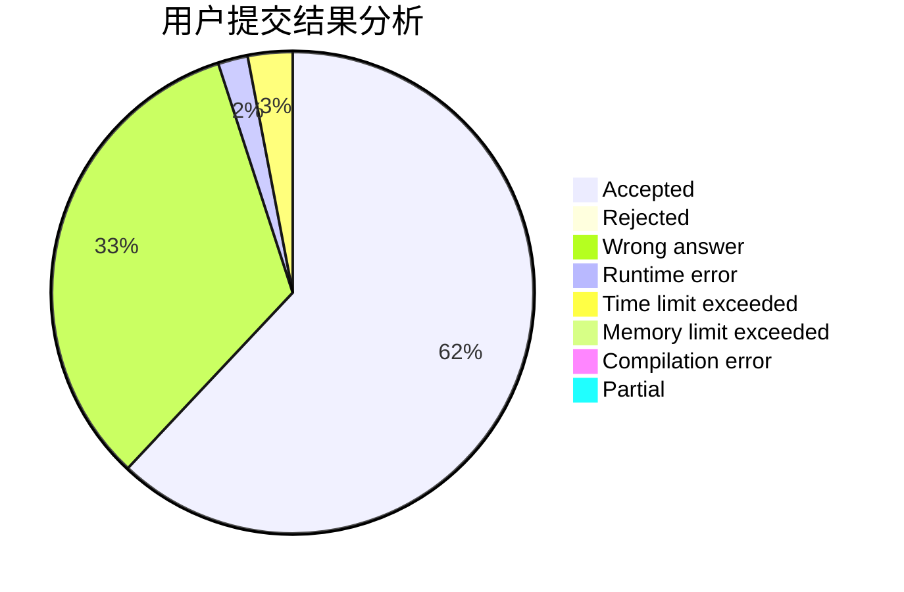
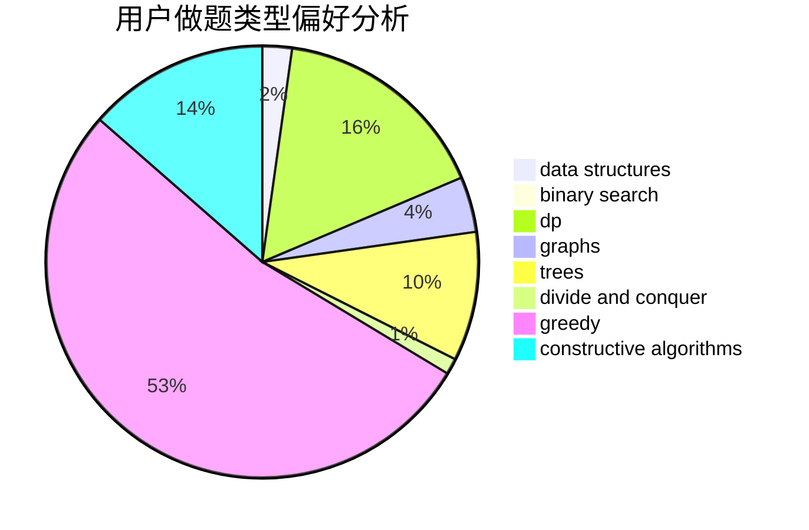
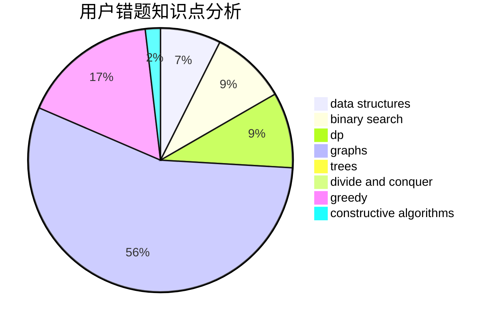

# xxfy

<!-- tabs:start -->

#### **用户提交结果分析**

#### **用户做题类型偏好分析**

#### **用户错题知识点分析**

<!-- tabs:end -->
# 推荐题目
[1316E](https://codeforces.com/contest/1316/problem/E)		bitmasks,
                        dp,
                        greedy,
                        sortings		  
[1255C](https://codeforces.com/contest/1255/problem/C)		constructive algorithms,
                        implementation		  
[782A](https://codeforces.com/contest/782/problem/A)		dsu,graphs,sortings,trees		  
[615D](https://codeforces.com/contest/615/problem/D)		math,
                        number theory		  
[451A](https://codeforces.com/contest/451/problem/A)		implementation		  
[960E](https://codeforces.com/contest/960/problem/E)		combinatorics,
                        dfs and similar,
                        divide and conquer,
                        dp,
                        probabilities,
                        trees		  
[820D](https://codeforces.com/contest/820/problem/D)		dsu,graphs,sortings,trees		  
[234C](https://codeforces.com/contest/234/problem/C)		dp,
                        implementation		  
[780D](https://codeforces.com/contest/780/problem/D)		2-sat,
                        graphs,
                        greedy,
                        implementation,
                        shortest paths,
                        strings		  
[402D](https://codeforces.com/contest/402/problem/D)		dp,
                        greedy,
                        math,
                        number theory		  
