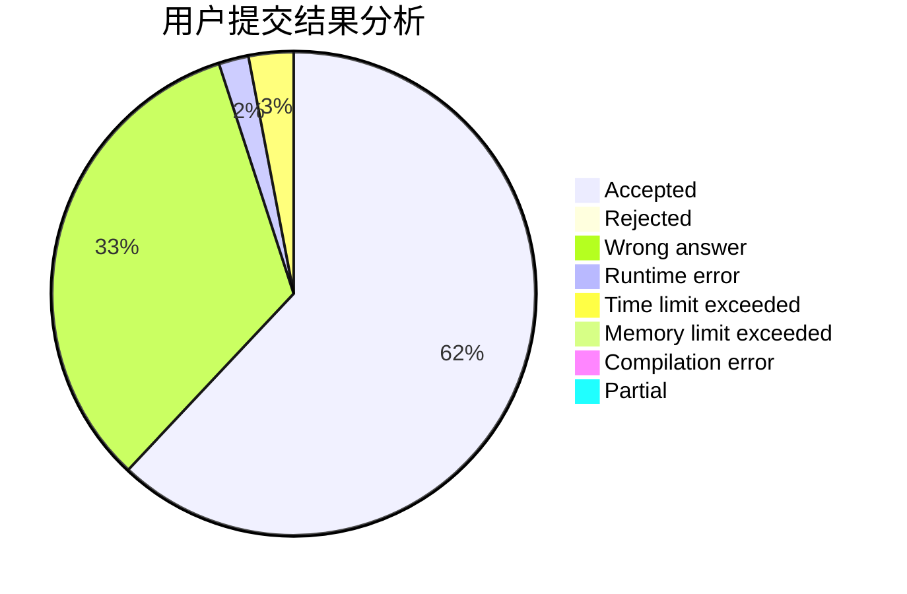
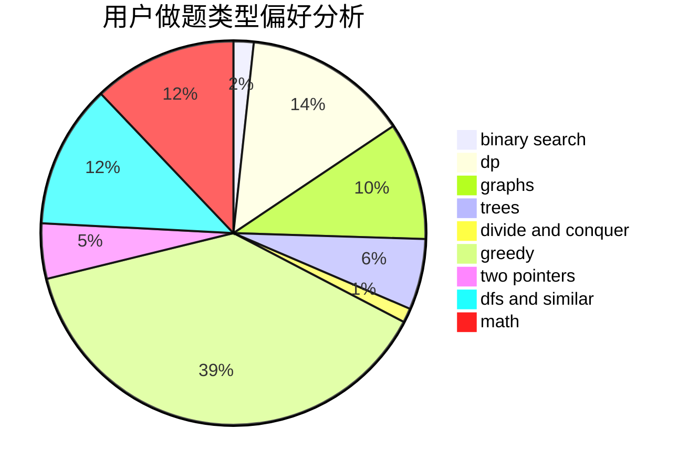

# xxfy

<!-- tabs:start -->

#### **用户提交结果分析**

#### **用户做题类型偏好分析**

<!-- tabs:end -->
# 推荐题目
[1316E](https://codeforces.com/contest/1316/problem/E)
[1255C](https://codeforces.com/contest/1255/problem/C)
[782A](https://codeforces.com/contest/782/problem/A)
[615D](https://codeforces.com/contest/615/problem/D)
[451A](https://codeforces.com/contest/451/problem/A)
[960E](https://codeforces.com/contest/960/problem/E)
[820D](https://codeforces.com/contest/820/problem/D)
[234C](https://codeforces.com/contest/234/problem/C)
[780D](https://codeforces.com/contest/780/problem/D)
[402D](https://codeforces.com/contest/402/problem/D)
