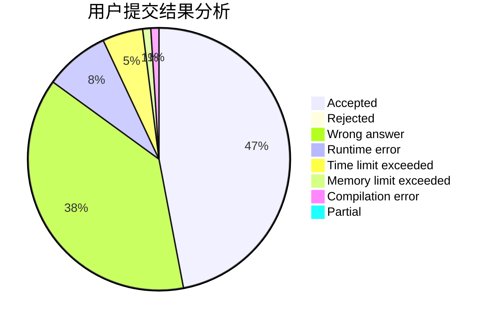
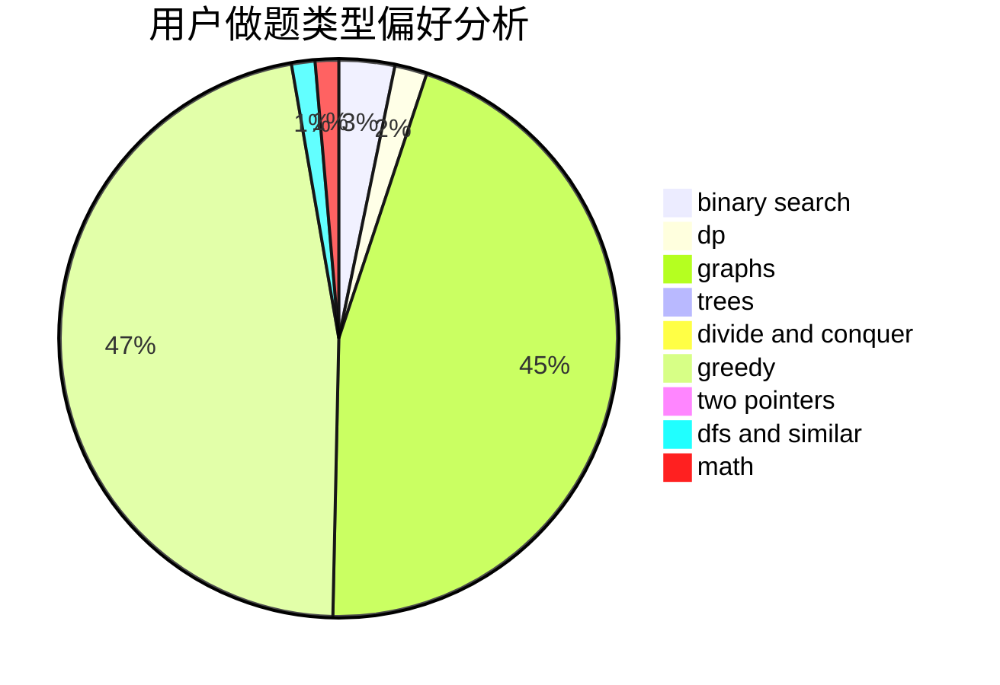

# xxjAc

<!-- tabs:start -->

#### **用户提交结果分析**

#### **用户做题类型偏好分析**

<!-- tabs:end -->
# 推荐题目
[484E](https://codeforces.com/contest/484/problem/E)
[605C](https://codeforces.com/contest/605/problem/C)
[17E](https://codeforces.com/contest/17/problem/E)
[1067B](https://codeforces.com/contest/1067/problem/B)
[730E](https://codeforces.com/contest/730/problem/E)
[639E](https://codeforces.com/contest/639/problem/E)
[893D](https://codeforces.com/contest/893/problem/D)
[675A](https://codeforces.com/contest/675/problem/A)
[1138D](https://codeforces.com/contest/1138/problem/D)
[1027E](https://codeforces.com/contest/1027/problem/E)
