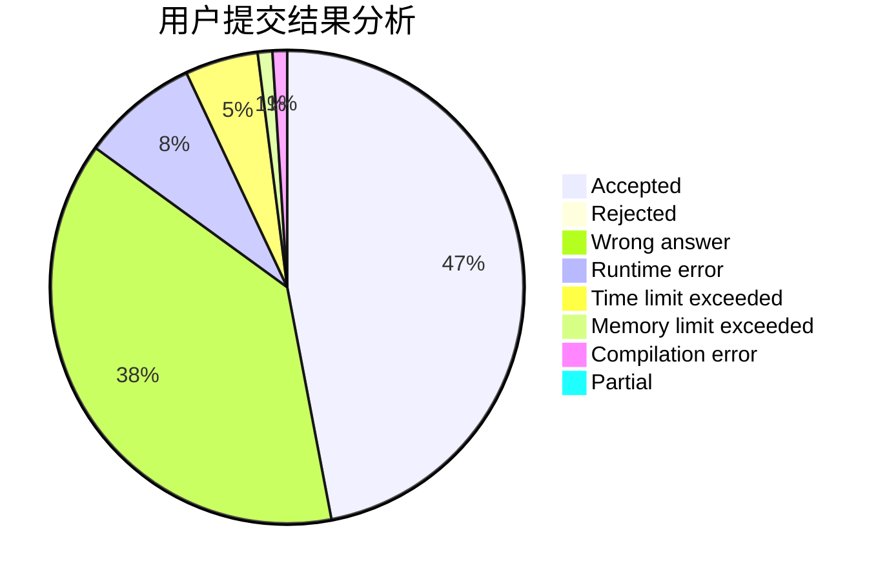
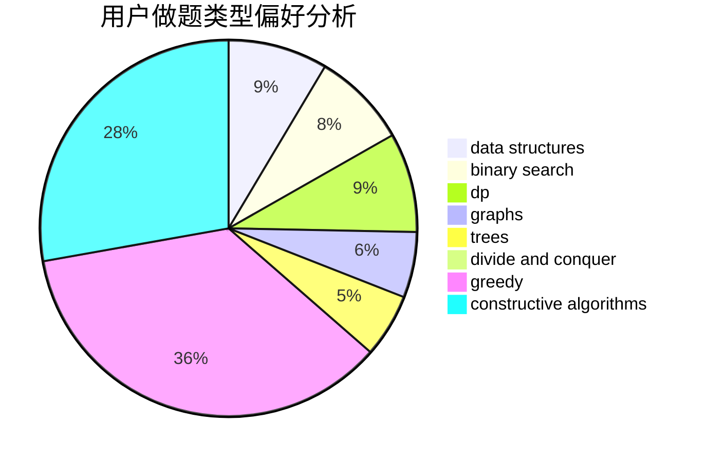
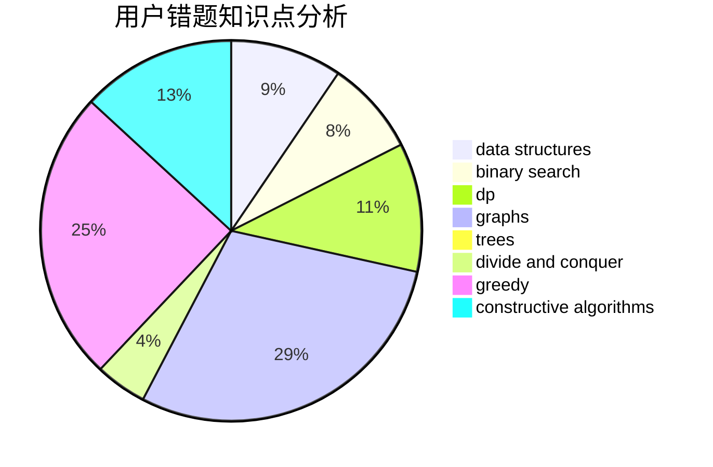

# xxjAc

<!-- tabs:start -->

#### **用户提交结果分析**

#### **用户做题类型偏好分析**

#### **用户错题知识点分析**

<!-- tabs:end -->
# 推荐题目
[465D](https://codeforces.com/contest/465/problem/D)		dsu,graphs,sortings,trees		  
[585B](https://codeforces.com/contest/585/problem/B)		dfs and similar,
                        graphs,
                        shortest paths		  
[158B](https://codeforces.com/contest/158/problem/B)		*special problem,
                        greedy,
                        implementation		  
[1066E](https://codeforces.com/contest/1066/problem/E)		data structures,
                        implementation,
                        math		  
[710B](https://codeforces.com/contest/710/problem/B)		brute force,
                        sortings		  
[618F](https://codeforces.com/contest/618/problem/F)		constructive algorithms,
                        two pointers		  
[872B](https://codeforces.com/contest/872/problem/B)		dsu,graphs,sortings,trees		  
[651A](https://codeforces.com/contest/651/problem/A)		dp,
                        greedy,
                        implementation,
                        math		  
[1136B](https://codeforces.com/contest/1136/problem/B)		constructive algorithms,
                        math		  
[1027B](https://codeforces.com/contest/1027/problem/B)		implementation,
                        math		  
