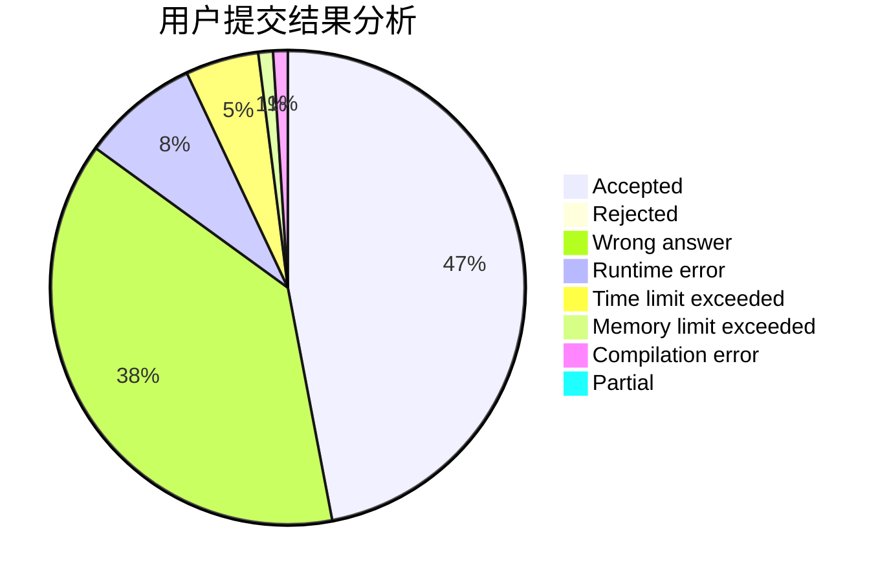
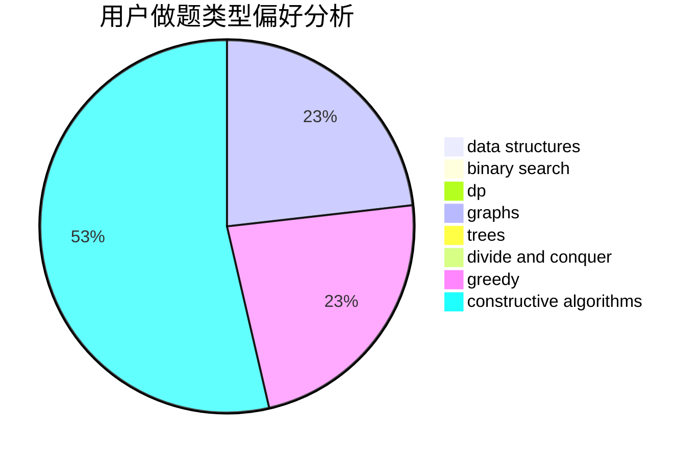
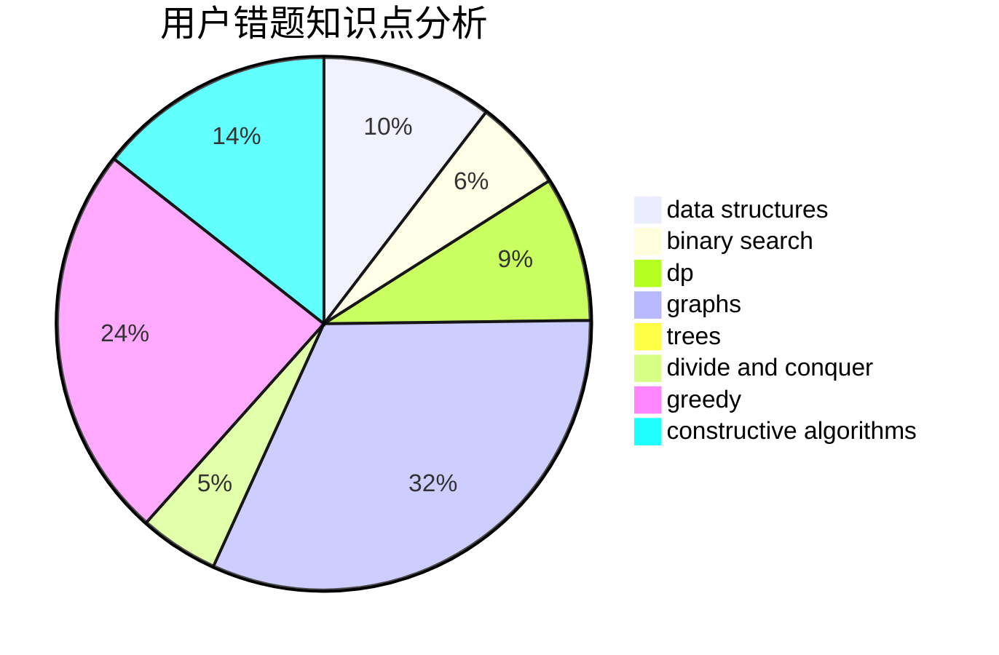

# xxjAc

<!-- tabs:start -->

#### **用户提交结果分析**

#### **用户做题类型偏好分析**

#### **用户错题知识点分析**

<!-- tabs:end -->
# 推荐题目
[484E](https://codeforces.com/contest/484/problem/E)		binary search,
                        constructive algorithms,
                        data structures		  
[605C](https://codeforces.com/contest/605/problem/C)		geometry		  
[17E](https://codeforces.com/contest/17/problem/E)		strings		  
[1067B](https://codeforces.com/contest/1067/problem/B)		dfs and similar,
                        graphs,
                        shortest paths		  
[730E](https://codeforces.com/contest/730/problem/E)		greedy,
                        implementation		  
[639E](https://codeforces.com/contest/639/problem/E)		binary search,
                        greedy,
                        math,
                        sortings		  
[893D](https://codeforces.com/contest/893/problem/D)		data structures,
                        dp,
                        greedy,
                        implementation		  
[675A](https://codeforces.com/contest/675/problem/A)		math		  
[1138D](https://codeforces.com/contest/1138/problem/D)		dsu,graphs,sortings,trees		  
[1027E](https://codeforces.com/contest/1027/problem/E)		combinatorics,
                        dp,
                        math		  
