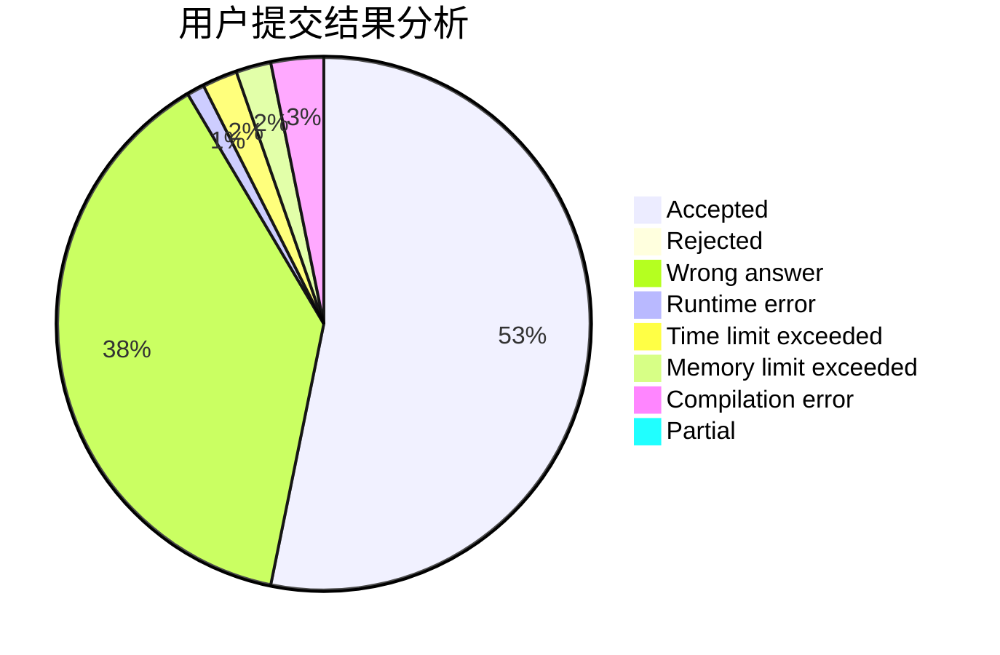
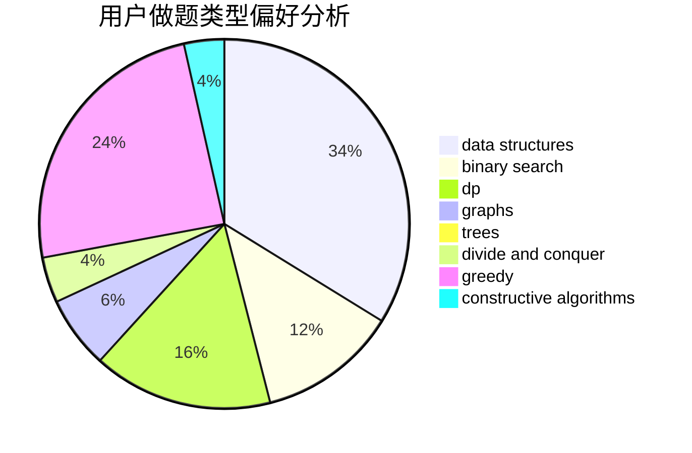

# xxxsdxsd

<!-- tabs:start -->

#### **用户提交结果分析**

#### **用户做题类型偏好分析**

#### **用户错题知识点分析**

<!-- tabs:end -->
# 推荐题目
[1510I](https://codeforces.com/contest/1510/problem/I)		greedy,
                        interactive,
                        math,
                        probabilities		  
[915G](https://codeforces.com/contest/915/problem/G)		math,
                        number theory		  
[1401A](https://codeforces.com/contest/1401/problem/A)		constructive algorithms,
                        math		  
[898A](https://codeforces.com/contest/898/problem/A)		implementation,
                        math		  
[777C](https://codeforces.com/contest/777/problem/C)		binary search,
                        data structures,
                        dp,
                        greedy,
                        implementation,
                        two pointers		  
[1166E](https://codeforces.com/contest/1166/problem/E)		bitmasks,
                        brute force,
                        constructive algorithms,
                        math,
                        number theory		  
[1A](https://codeforces.com/contest/1/problem/A)		math		  
[923A](https://codeforces.com/contest/923/problem/A)		math,
                        number theory		  
[924D](https://codeforces.com/contest/924/problem/D)		nan		  
[835C](https://codeforces.com/contest/835/problem/C)		dp,
                        implementation		  
