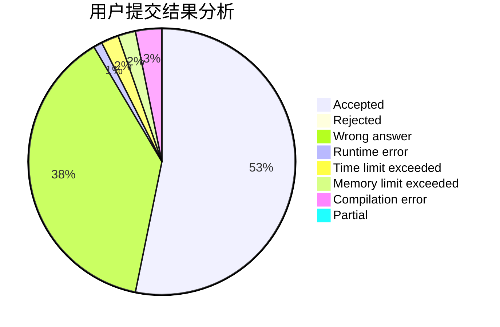
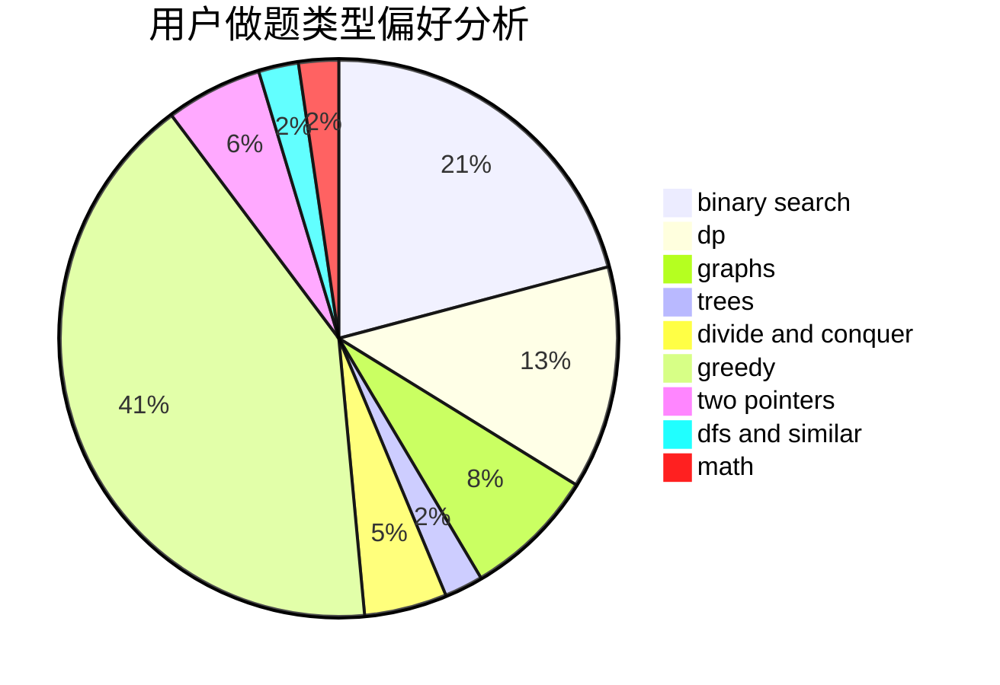

# xxxsdxsd

<!-- tabs:start -->

#### **用户提交结果分析**

#### **用户做题类型偏好分析**

<!-- tabs:end -->
# 推荐题目
[166A](https://codeforces.com/contest/166/problem/A)
[935F](https://codeforces.com/contest/935/problem/F)
[1411C](https://codeforces.com/contest/1411/problem/C)
[914C](https://codeforces.com/contest/914/problem/C)
[795K](https://codeforces.com/contest/795/problem/K)
[116A](https://codeforces.com/contest/116/problem/A)
[223E](https://codeforces.com/contest/223/problem/E)
[946F](https://codeforces.com/contest/946/problem/F)
[948B](https://codeforces.com/contest/948/problem/B)
[853A](https://codeforces.com/contest/853/problem/A)
