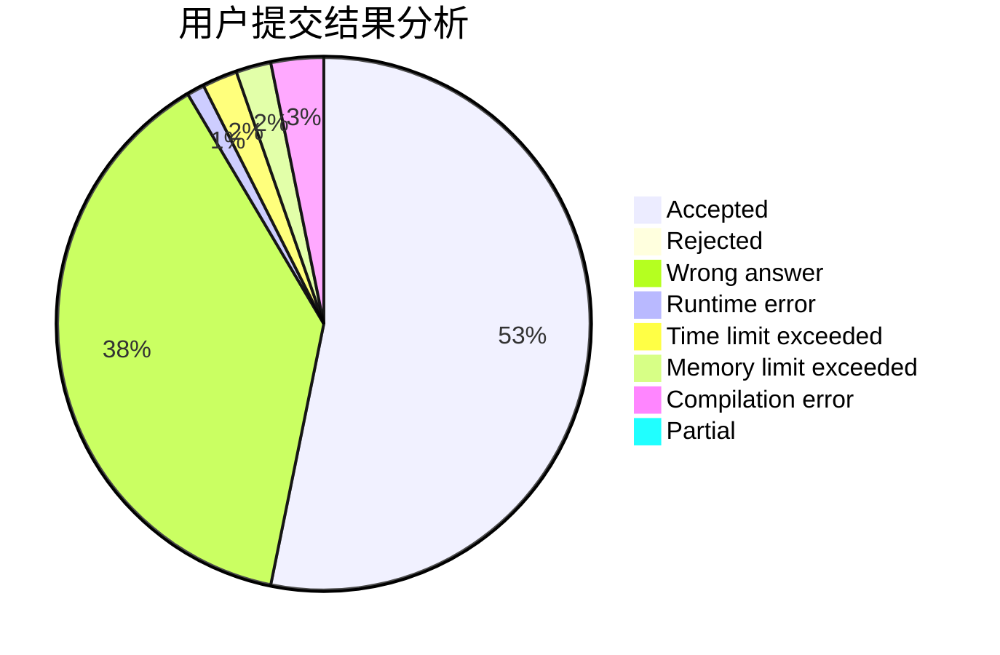
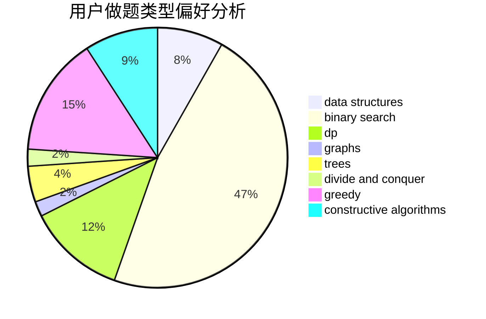

# xxxsdxsd

<!-- tabs:start -->

#### **用户提交结果分析**

#### **用户做题类型偏好分析**

#### **用户错题知识点分析**

<!-- tabs:end -->
# 推荐题目
[166A](https://codeforces.com/contest/166/problem/A)		binary search,
                        implementation,
                        sortings		  
[935F](https://codeforces.com/contest/935/problem/F)		data structures,
                        greedy		  
[1411C](https://codeforces.com/contest/1411/problem/C)		dfs and similar,
                        dsu,
                        graphs		  
[914C](https://codeforces.com/contest/914/problem/C)		brute force,
                        combinatorics,
                        dp		  
[795K](https://codeforces.com/contest/795/problem/K)		dsu,graphs,sortings,trees		  
[116A](https://codeforces.com/contest/116/problem/A)		implementation		  
[223E](https://codeforces.com/contest/223/problem/E)		flows,
                        geometry,
                        graphs		  
[946F](https://codeforces.com/contest/946/problem/F)		combinatorics,
                        dp,
                        matrices		  
[948B](https://codeforces.com/contest/948/problem/B)		dsu,graphs,sortings,trees		  
[853A](https://codeforces.com/contest/853/problem/A)		greedy		  
