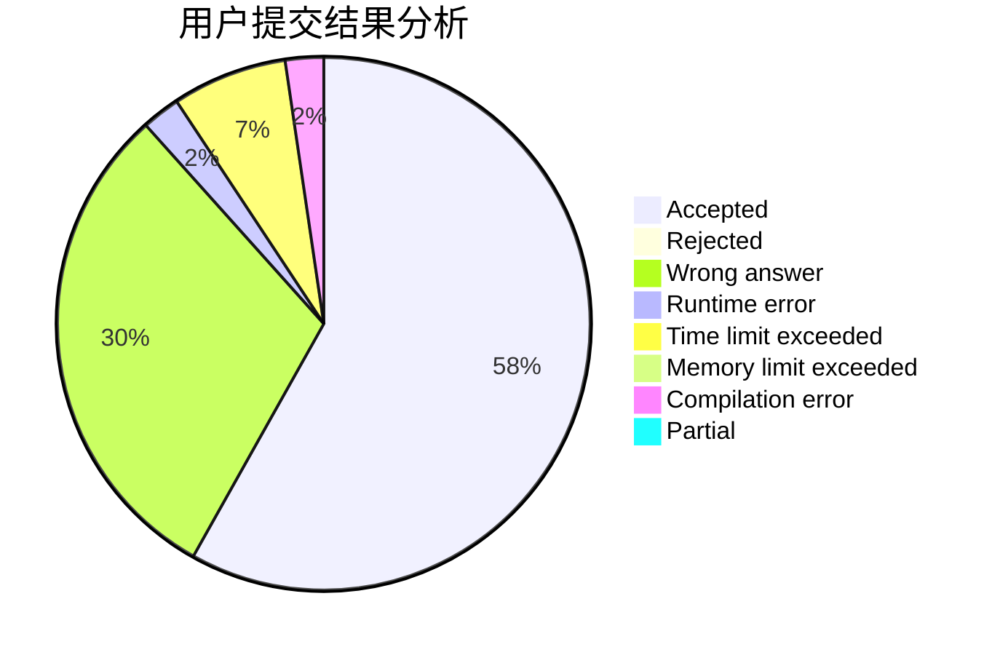
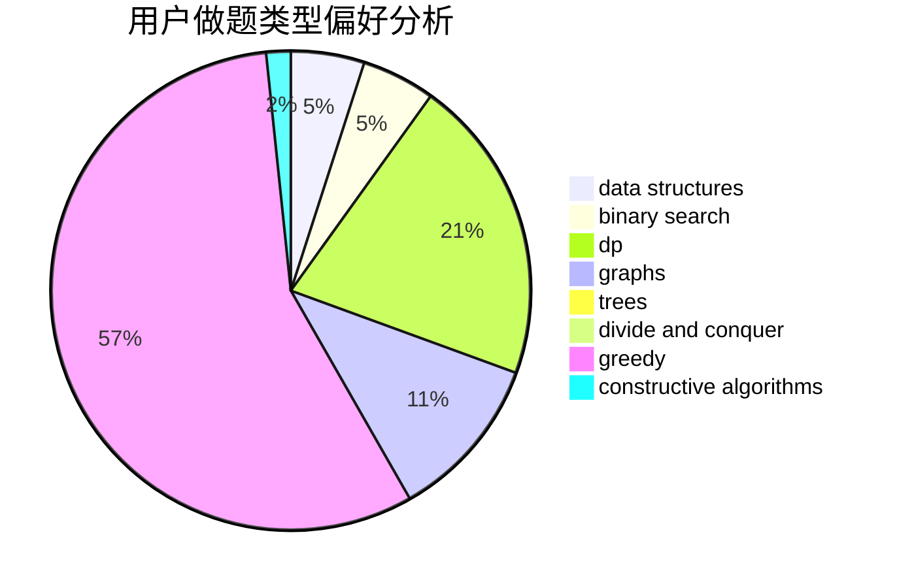
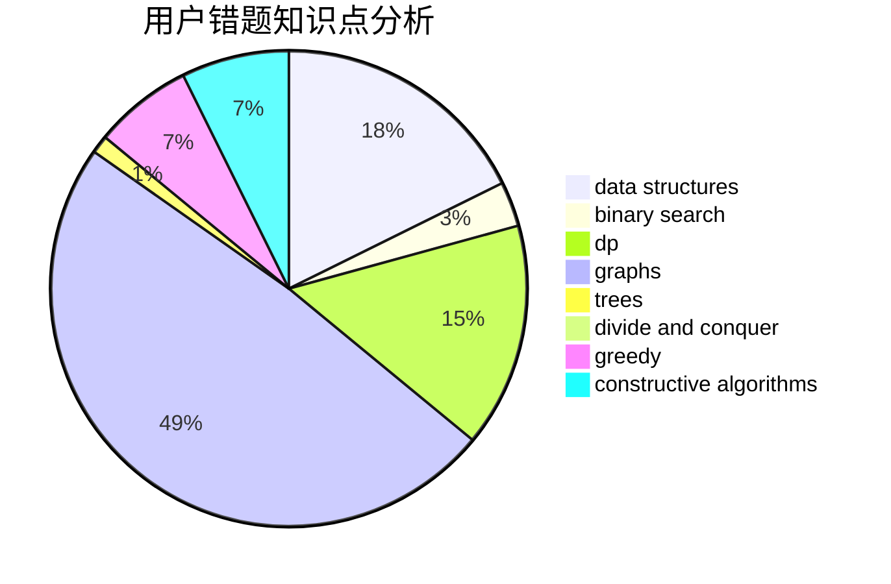

# xxxtql

<!-- tabs:start -->

#### **用户提交结果分析**

#### **用户做题类型偏好分析**

#### **用户错题知识点分析**

<!-- tabs:end -->
# 推荐题目
[781E](https://codeforces.com/contest/781/problem/E)		dsu,graphs,sortings,trees		  
[158C](https://codeforces.com/contest/158/problem/C)		*special problem,
                        data structures,
                        implementation		  
[835B](https://codeforces.com/contest/835/problem/B)		greedy		  
[810A](https://codeforces.com/contest/810/problem/A)		implementation,
                        math		  
[700C](https://codeforces.com/contest/700/problem/C)		dfs and similar,
                        graphs		  
[1186C](https://codeforces.com/contest/1186/problem/C)		implementation,
                        math		  
[727F](https://codeforces.com/contest/727/problem/F)		binary search,
                        dp,
                        greedy		  
[730D](https://codeforces.com/contest/730/problem/D)		greedy,
                        implementation,
                        math		  
[741A](https://codeforces.com/contest/741/problem/A)		dfs and similar,
                        math		  
[959F](https://codeforces.com/contest/959/problem/F)		bitmasks,
                        dp,
                        math,
                        matrices		  
