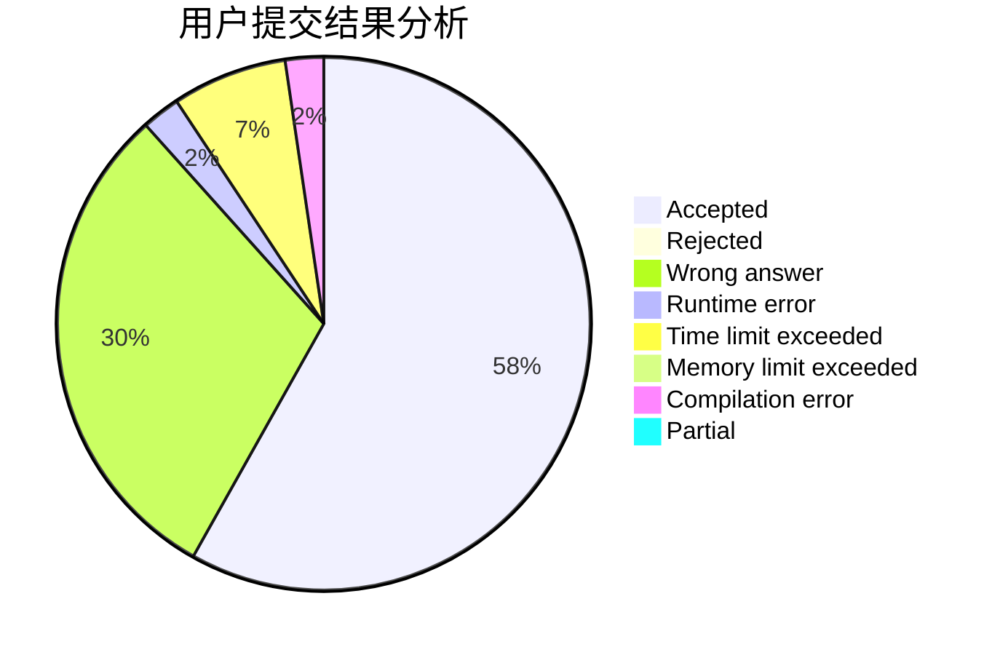
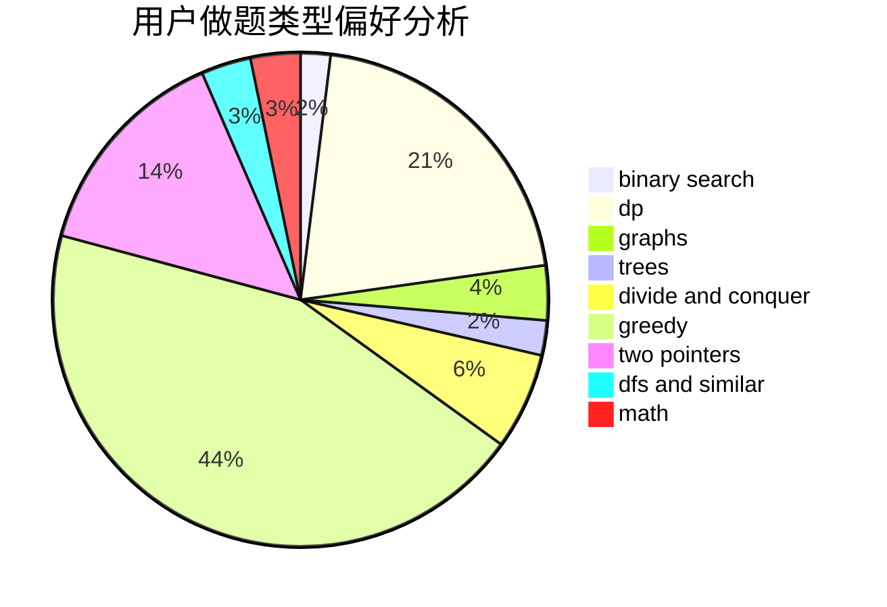

# xxxtql

<!-- tabs:start -->

#### **用户提交结果分析**

#### **用户做题类型偏好分析**

<!-- tabs:end -->
# 推荐题目
[7C](https://codeforces.com/contest/7/problem/C)
[180C](https://codeforces.com/contest/180/problem/C)
[852I](https://codeforces.com/contest/852/problem/I)
[828A](https://codeforces.com/contest/828/problem/A)
[718D](https://codeforces.com/contest/718/problem/D)
[118E](https://codeforces.com/contest/118/problem/E)
[745C](https://codeforces.com/contest/745/problem/C)
[747D](https://codeforces.com/contest/747/problem/D)
[762A](https://codeforces.com/contest/762/problem/A)
[981D](https://codeforces.com/contest/981/problem/D)
