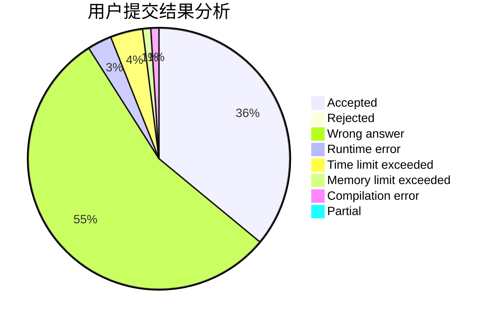
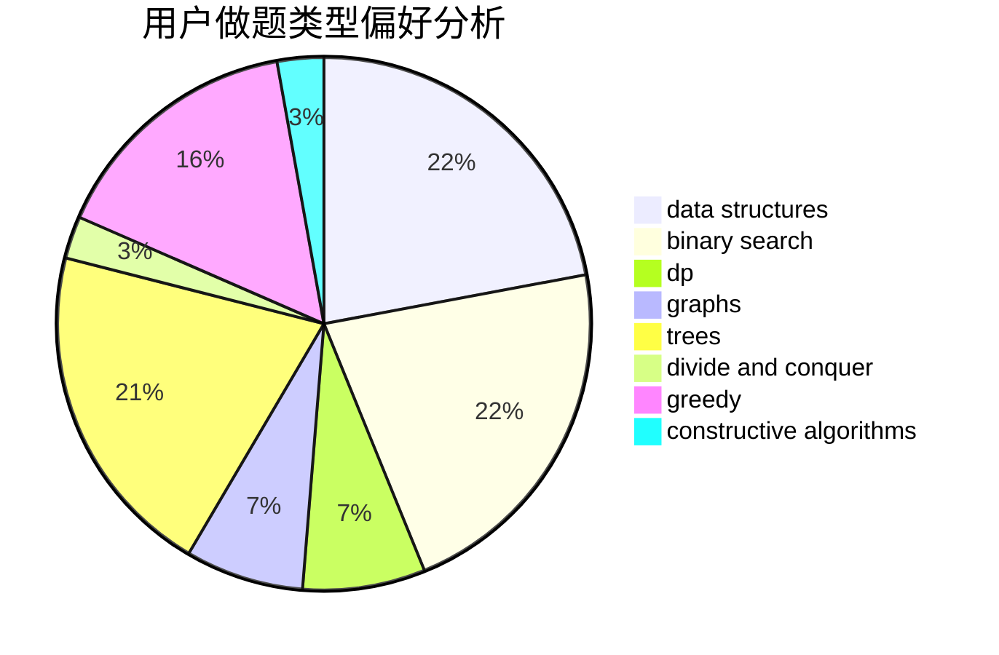
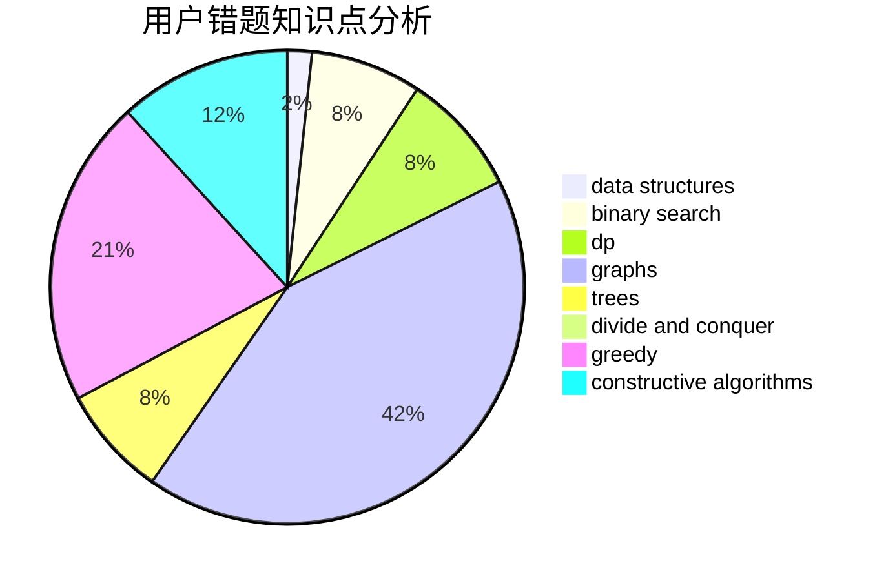

# xxxyk

<!-- tabs:start -->

#### **用户提交结果分析**

#### **用户做题类型偏好分析**

#### **用户错题知识点分析**

<!-- tabs:end -->
# 推荐题目
[580D](https://codeforces.com/contest/580/problem/D)		bitmasks,
                        dp		  
[633A](https://codeforces.com/contest/633/problem/A)		brute force,
                        math,
                        number theory		  
[708D](https://codeforces.com/contest/708/problem/D)		flows		  
[962G](https://codeforces.com/contest/962/problem/G)		data structures,
                        dsu,
                        geometry,
                        trees		  
[1300D](https://codeforces.com/contest/1300/problem/D)		dsu,graphs,sortings,trees		  
[702F](https://codeforces.com/contest/702/problem/F)		data structures		  
[916E](https://codeforces.com/contest/916/problem/E)		data structures,
                        trees		  
[1029F](https://codeforces.com/contest/1029/problem/F)		binary search,
                        brute force,
                        math,
                        number theory		  
[1002B4](https://codeforces.com/contest/1002B/problem/4)		nan		  
[1165D](https://codeforces.com/contest/1165/problem/D)		math,
                        number theory		  
