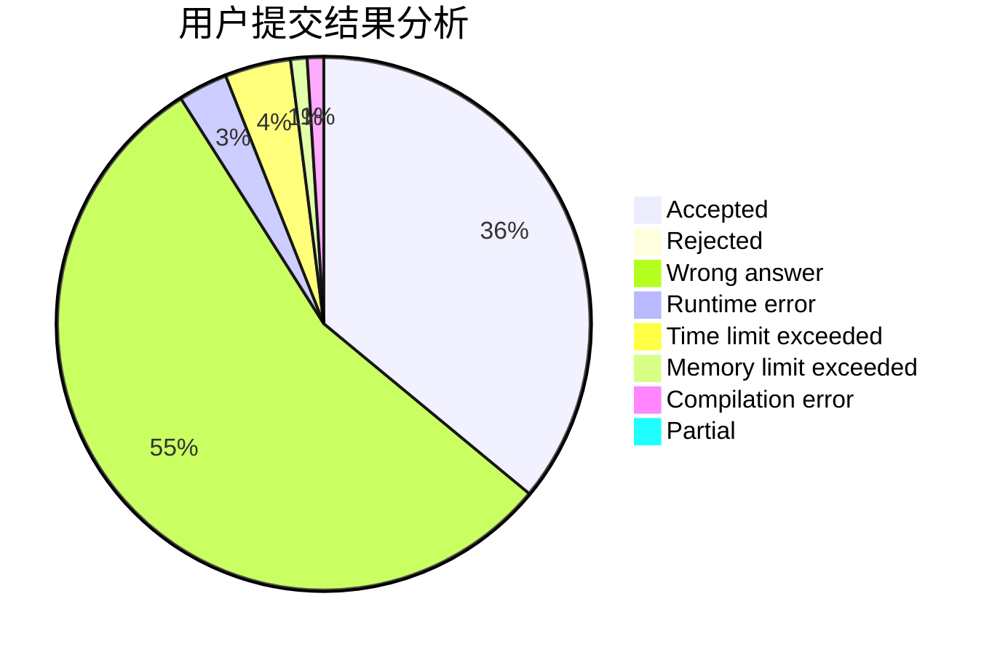
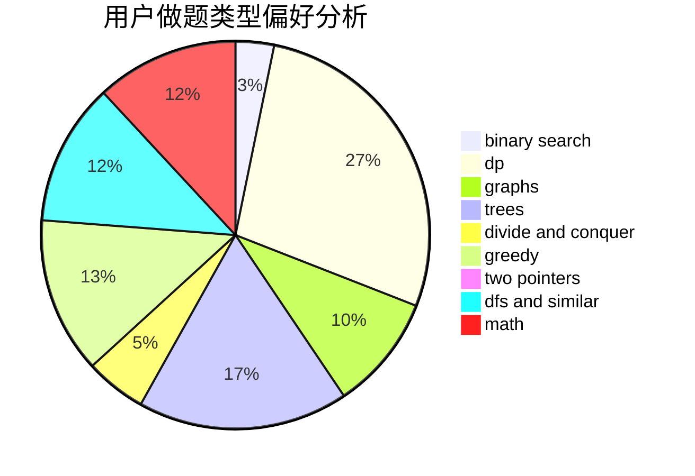

# xxxyk

<!-- tabs:start -->

#### **用户提交结果分析**

#### **用户做题类型偏好分析**

<!-- tabs:end -->
# 推荐题目
[600F](https://codeforces.com/contest/600/problem/F)
[665C](https://codeforces.com/contest/665/problem/C)
[727F](https://codeforces.com/contest/727/problem/F)
[985E](https://codeforces.com/contest/985/problem/E)
[1310B](https://codeforces.com/contest/1310/problem/B)
[721D](https://codeforces.com/contest/721/problem/D)
[937A](https://codeforces.com/contest/937/problem/A)
[1030A](https://codeforces.com/contest/1030/problem/A)
[10023](https://codeforces.com/contest/1002/problem/3)
[1167F](https://codeforces.com/contest/1167/problem/F)
