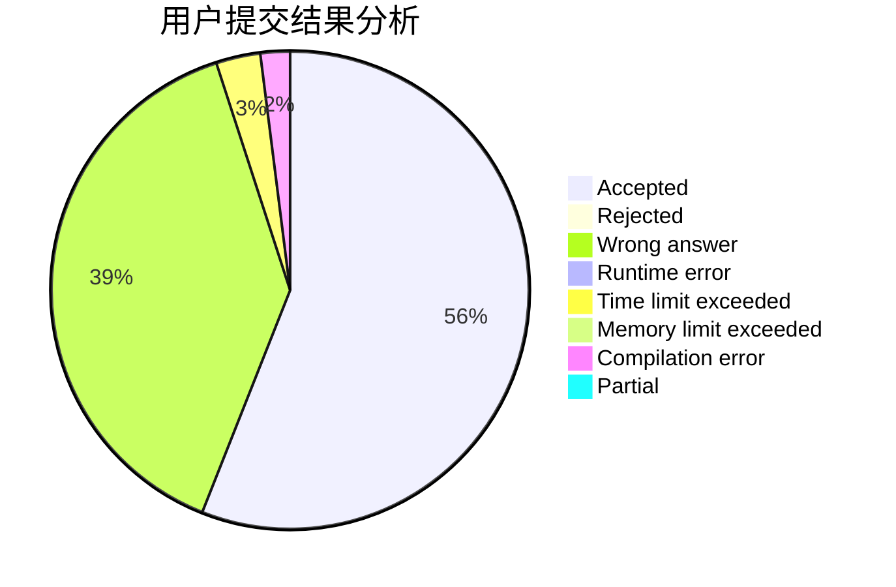
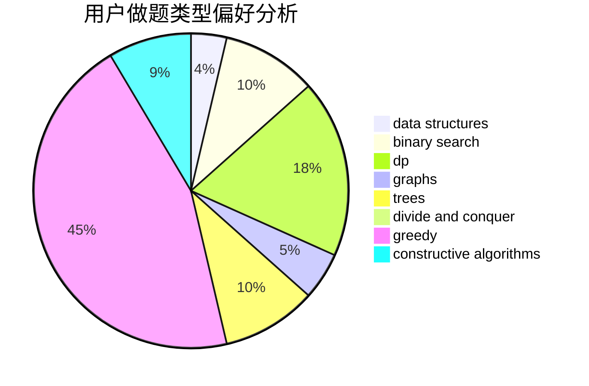
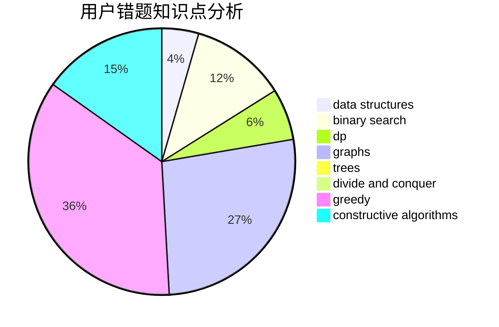

# xxyxx

<!-- tabs:start -->

#### **用户提交结果分析**

#### **用户做题类型偏好分析**

#### **用户错题知识点分析**

<!-- tabs:end -->
# 推荐题目
[677C](https://codeforces.com/contest/677/problem/C)		bitmasks,
                        combinatorics,
                        implementation,
                        strings		  
[883I](https://codeforces.com/contest/883/problem/I)		binary search,
                        dp		  
[241D](https://codeforces.com/contest/241/problem/D)		nan		  
[975A](https://codeforces.com/contest/975/problem/A)		implementation,
                        strings		  
[679E](https://codeforces.com/contest/679/problem/E)		data structures		  
[932A](https://codeforces.com/contest/932/problem/A)		constructive algorithms		  
[110A](https://codeforces.com/contest/110/problem/A)		implementation		  
[215D](https://codeforces.com/contest/215/problem/D)		greedy		  
[1340E](https://codeforces.com/contest/1340/problem/E)		graphs,
                        interactive,
                        probabilities		  
[93C](https://codeforces.com/contest/93/problem/C)		brute force,
                        implementation		  
