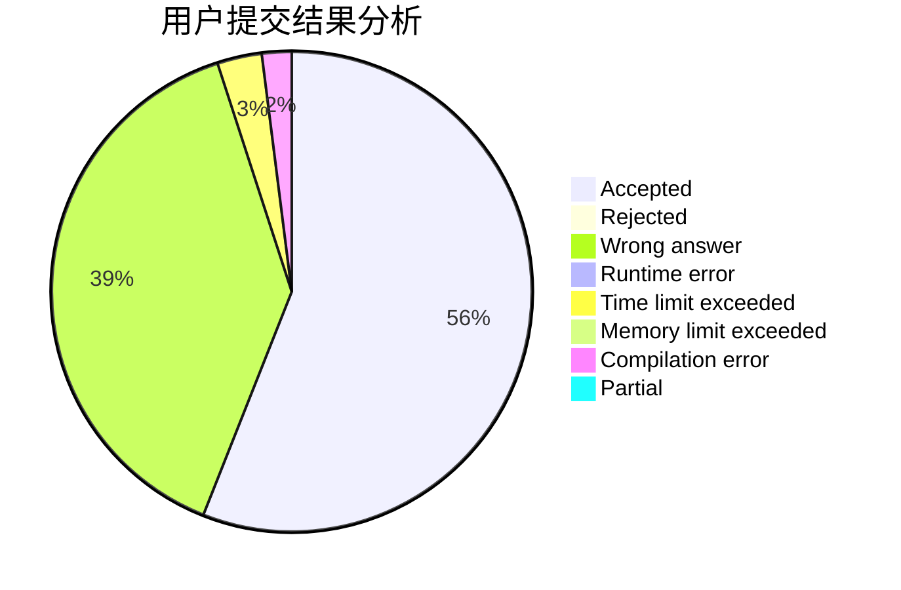
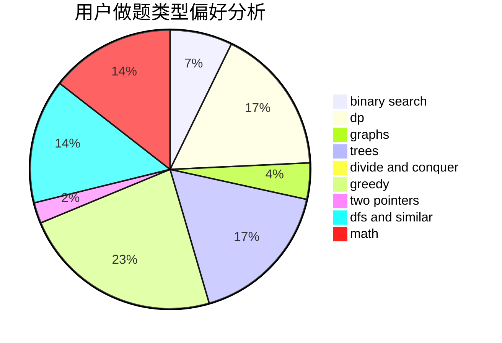

# xxyxx

<!-- tabs:start -->

#### **用户提交结果分析**

#### **用户做题类型偏好分析**

<!-- tabs:end -->
# 推荐题目
[701C](https://codeforces.com/contest/701/problem/C)
[901C](https://codeforces.com/contest/901/problem/C)
[263A](https://codeforces.com/contest/263/problem/A)
[989E](https://codeforces.com/contest/989/problem/E)
[703C](https://codeforces.com/contest/703/problem/C)
[952F](https://codeforces.com/contest/952/problem/F)
[1110C](https://codeforces.com/contest/1110/problem/C)
[235A](https://codeforces.com/contest/235/problem/A)
[1347D](https://codeforces.com/contest/1347/problem/D)
[961C](https://codeforces.com/contest/961/problem/C)
