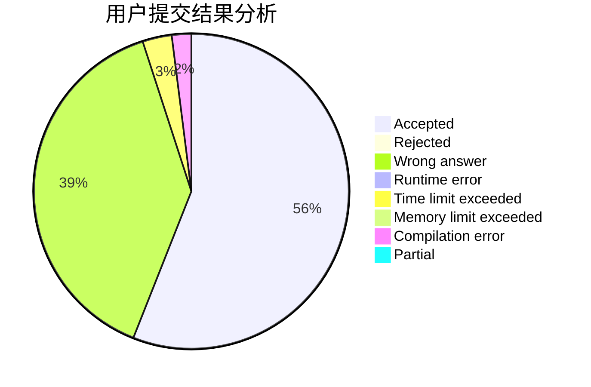
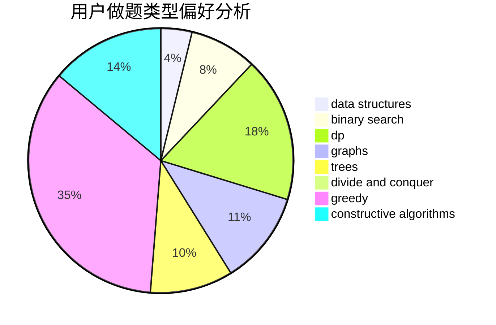
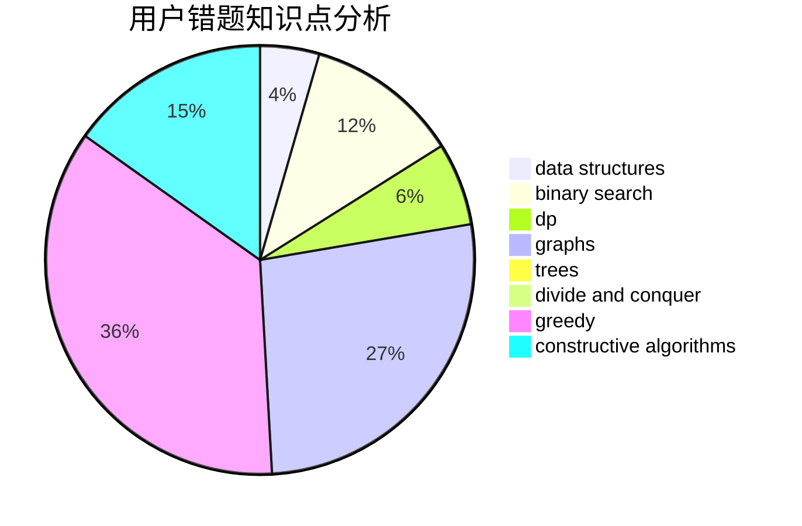

# xxyxx

<!-- tabs:start -->

#### **用户提交结果分析**

#### **用户做题类型偏好分析**

#### **用户错题知识点分析**

<!-- tabs:end -->
# 推荐题目
[701C](https://codeforces.com/contest/701/problem/C)		binary search,
                        strings,
                        two pointers		  
[901C](https://codeforces.com/contest/901/problem/C)		binary search,
                        data structures,
                        dfs and similar,
                        dsu,
                        graphs,
                        two pointers		  
[263A](https://codeforces.com/contest/263/problem/A)		implementation		  
[989E](https://codeforces.com/contest/989/problem/E)		dp,
                        geometry,
                        matrices,
                        probabilities		  
[703C](https://codeforces.com/contest/703/problem/C)		geometry,
                        implementation		  
[952F](https://codeforces.com/contest/952/problem/F)		nan		  
[1110C](https://codeforces.com/contest/1110/problem/C)		constructive algorithms,
                        math,
                        number theory		  
[235A](https://codeforces.com/contest/235/problem/A)		number theory		  
[1347D](https://codeforces.com/contest/1347/problem/D)		dsu,graphs,sortings,trees		  
[961C](https://codeforces.com/contest/961/problem/C)		bitmasks,
                        brute force,
                        implementation		  
