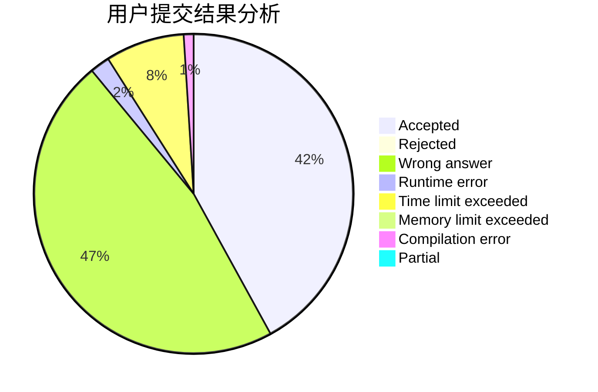
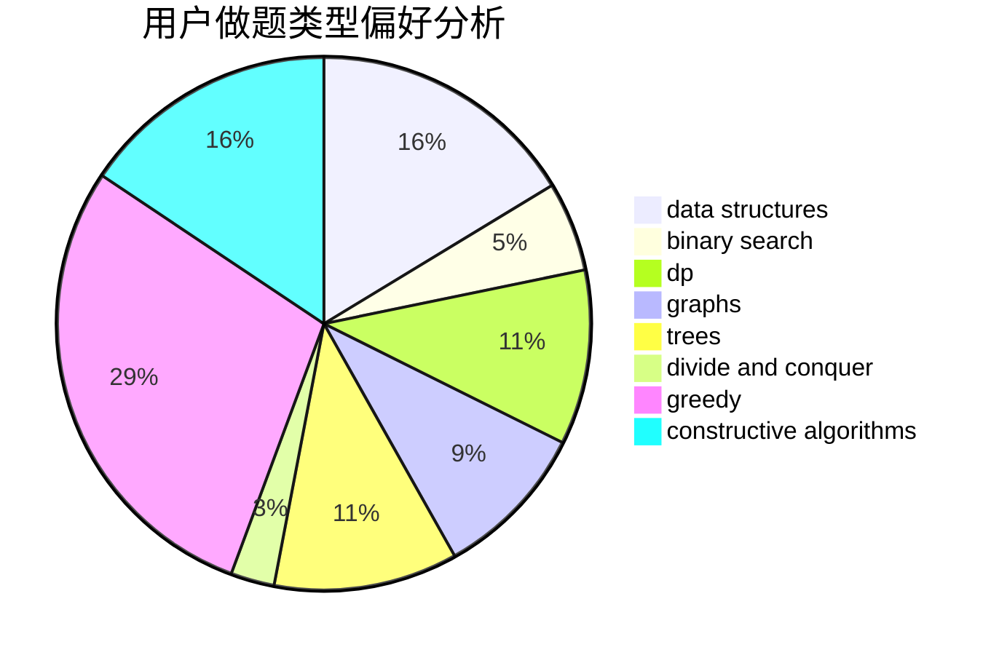
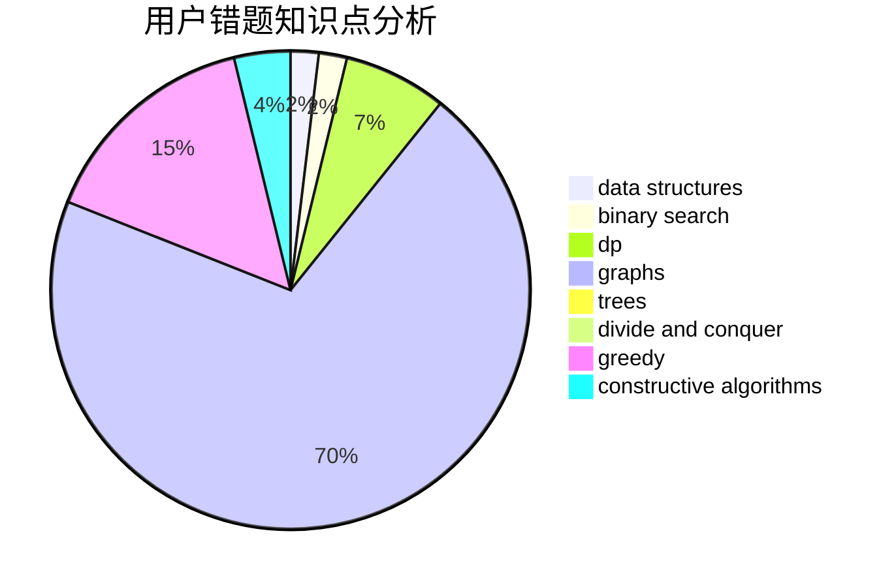

# xyf007

<!-- tabs:start -->

#### **用户提交结果分析**

#### **用户做题类型偏好分析**

#### **用户错题知识点分析**

<!-- tabs:end -->
# 推荐题目
[409H](https://codeforces.com/contest/409/problem/H)		*special problem,
                        brute force,
                        constructive algorithms,
                        dsu,
                        implementation		  
[757E](https://codeforces.com/contest/757/problem/E)		brute force,
                        combinatorics,
                        dp,
                        number theory		  
[702E](https://codeforces.com/contest/702/problem/E)		data structures,
                        graphs		  
[1240F](https://codeforces.com/contest/1240/problem/F)		graphs		  
[633B](https://codeforces.com/contest/633/problem/B)		brute force,
                        constructive algorithms,
                        math,
                        number theory		  
[296B](https://codeforces.com/contest/296/problem/B)		combinatorics,
                        dp		  
[1214D](https://codeforces.com/contest/1214/problem/D)		dfs and similar,
                        dp,
                        flows,
                        hashing		  
[610A](https://codeforces.com/contest/610/problem/A)		combinatorics,
                        math		  
[1358C](https://codeforces.com/contest/1358/problem/C)		math		  
[208C](https://codeforces.com/contest/208/problem/C)		dp,
                        graphs,
                        shortest paths		  
