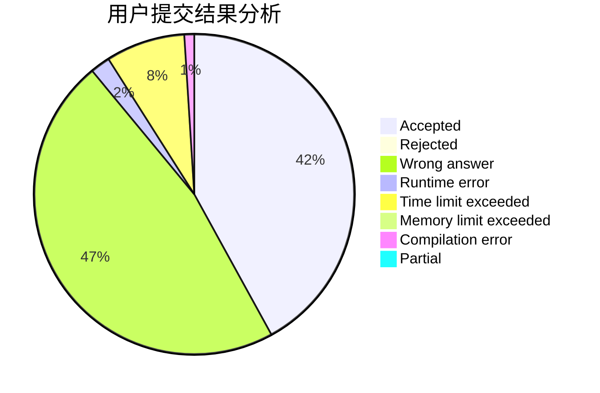
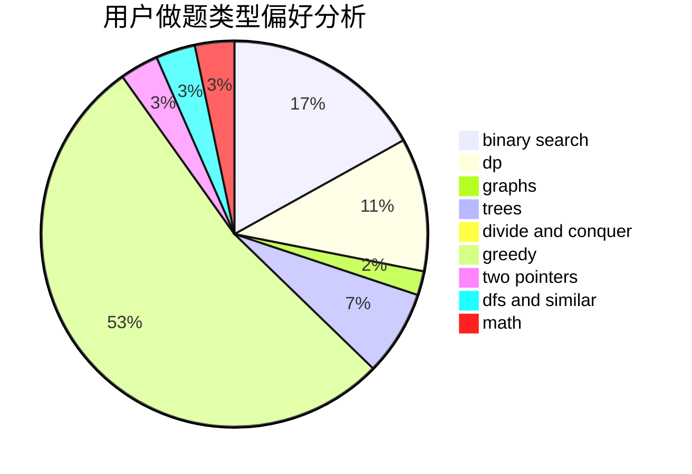

# xyf007

<!-- tabs:start -->

#### **用户提交结果分析**

#### **用户做题类型偏好分析**

<!-- tabs:end -->
# 推荐题目
[437B](https://codeforces.com/contest/437/problem/B)
[776D](https://codeforces.com/contest/776/problem/D)
[721C](https://codeforces.com/contest/721/problem/C)
[1246C](https://codeforces.com/contest/1246/problem/C)
[665D](https://codeforces.com/contest/665/problem/D)
[313C](https://codeforces.com/contest/313/problem/C)
[121E](https://codeforces.com/contest/121/problem/E)
[629C](https://codeforces.com/contest/629/problem/C)
[1366E](https://codeforces.com/contest/1366/problem/E)
[22E](https://codeforces.com/contest/22/problem/E)
