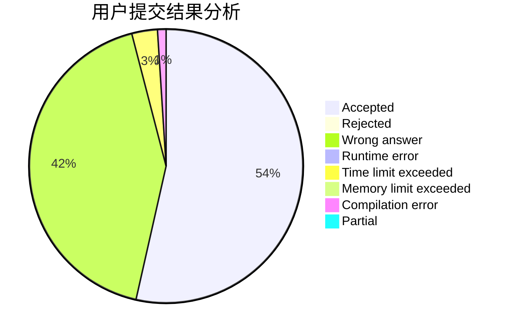
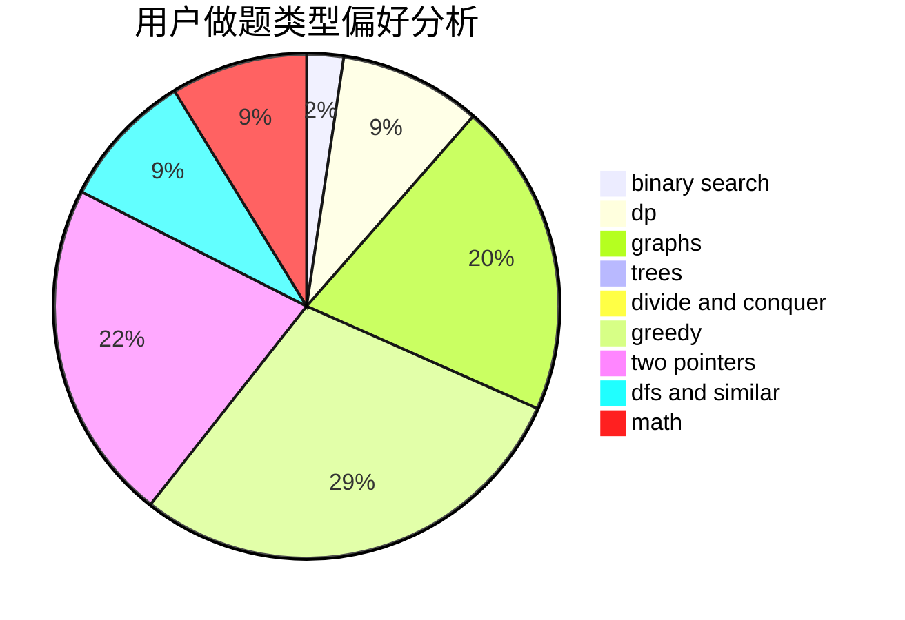

# xyhxou

<!-- tabs:start -->

#### **用户提交结果分析**

#### **用户做题类型偏好分析**

<!-- tabs:end -->
# 推荐题目
[1459E](https://codeforces.com/contest/1459/problem/E)
[682D](https://codeforces.com/contest/682/problem/D)
[828C](https://codeforces.com/contest/828/problem/C)
[778D](https://codeforces.com/contest/778/problem/D)
[1248C](https://codeforces.com/contest/1248/problem/C)
[987F](https://codeforces.com/contest/987/problem/F)
[723E](https://codeforces.com/contest/723/problem/E)
[1499G](https://codeforces.com/contest/1499/problem/G)
[208D](https://codeforces.com/contest/208/problem/D)
[1080B](https://codeforces.com/contest/1080/problem/B)
