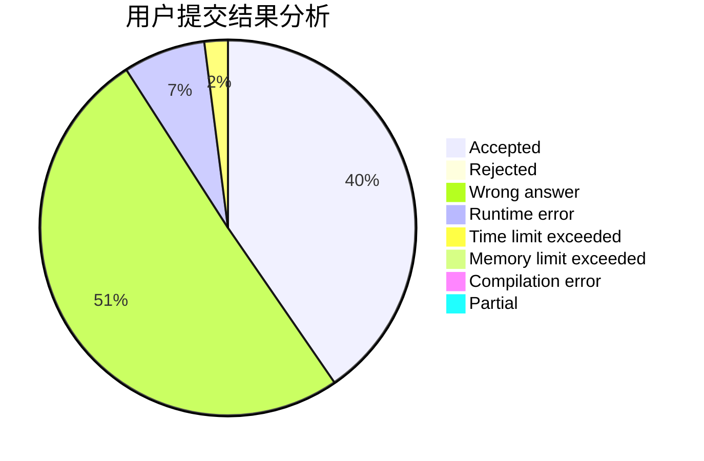
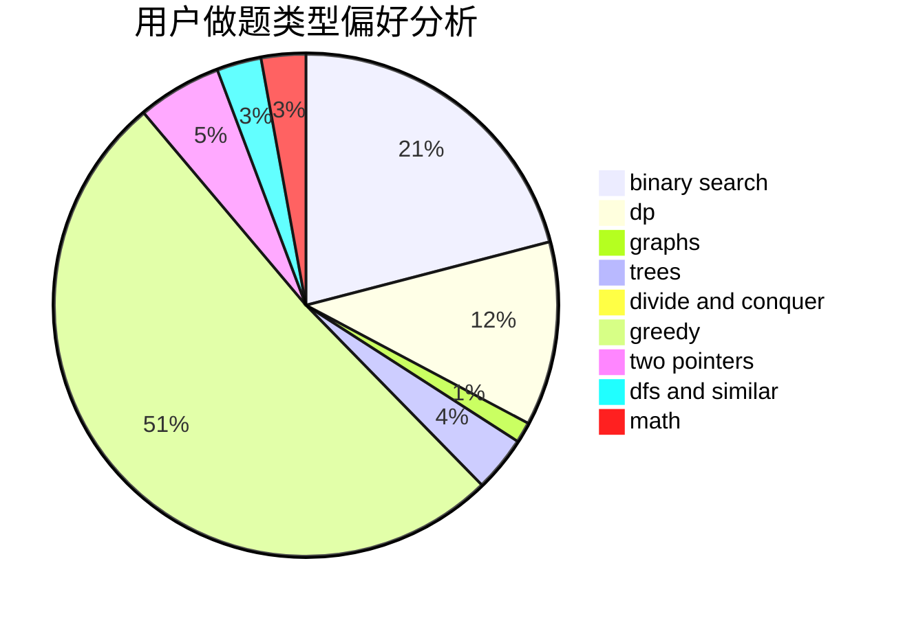

# xyizd

<!-- tabs:start -->

#### **用户提交结果分析**

#### **用户做题类型偏好分析**

<!-- tabs:end -->
# 推荐题目
[13352](https://codeforces.com/contest/1335/problem/2)
[701A](https://codeforces.com/contest/701/problem/A)
[913B](https://codeforces.com/contest/913/problem/B)
[152B](https://codeforces.com/contest/152/problem/B)
[582C](https://codeforces.com/contest/582/problem/C)
[1495E](https://codeforces.com/contest/1495/problem/E)
[138C](https://codeforces.com/contest/138/problem/C)
[1182A](https://codeforces.com/contest/1182/problem/A)
[847E](https://codeforces.com/contest/847/problem/E)
[668A](https://codeforces.com/contest/668/problem/A)
