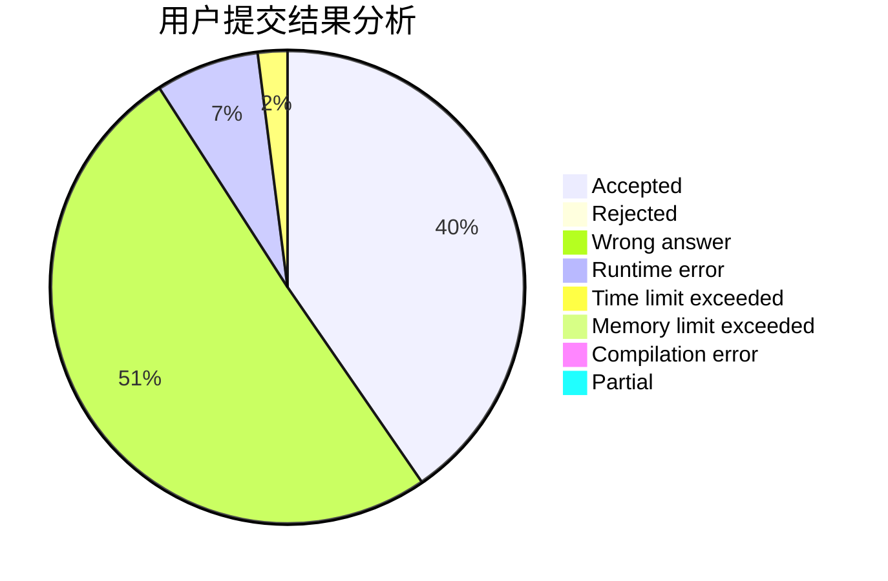
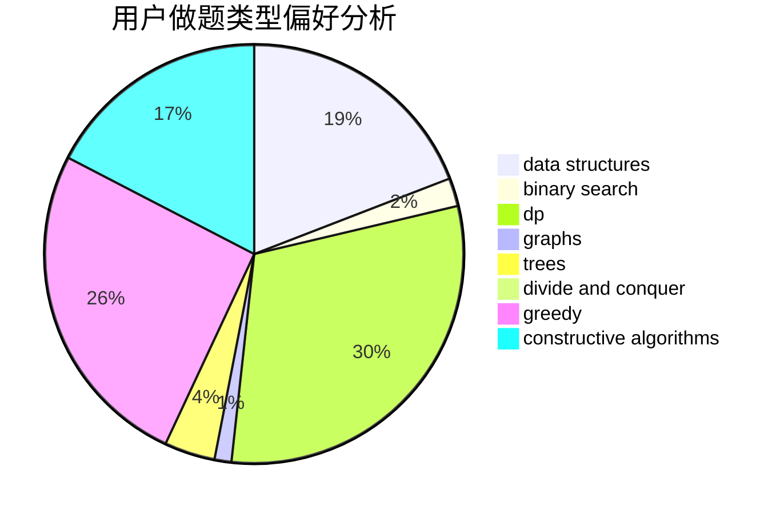
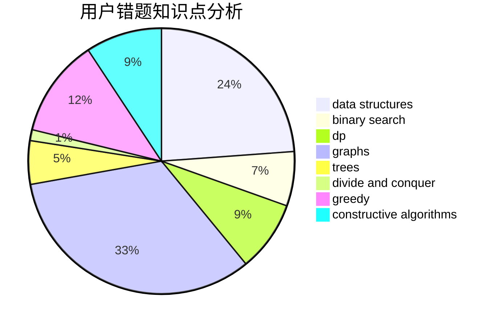

# xyizd

<!-- tabs:start -->

#### **用户提交结果分析**

#### **用户做题类型偏好分析**

#### **用户错题知识点分析**

<!-- tabs:end -->
# 推荐题目
[13352](https://codeforces.com/contest/1335/problem/2)		dsu,graphs,sortings,trees		  
[701A](https://codeforces.com/contest/701/problem/A)		greedy,
                        implementation		  
[913B](https://codeforces.com/contest/913/problem/B)		implementation,
                        trees		  
[152B](https://codeforces.com/contest/152/problem/B)		binary search,
                        implementation		  
[582C](https://codeforces.com/contest/582/problem/C)		number theory		  
[1495E](https://codeforces.com/contest/1495/problem/E)		brute force,
                        data structures,
                        greedy,
                        implementation		  
[138C](https://codeforces.com/contest/138/problem/C)		binary search,
                        data structures,
                        probabilities,
                        sortings		  
[1182A](https://codeforces.com/contest/1182/problem/A)		dp,
                        math		  
[847E](https://codeforces.com/contest/847/problem/E)		binary search,
                        dp		  
[668A](https://codeforces.com/contest/668/problem/A)		dsu,graphs,sortings,trees		  
