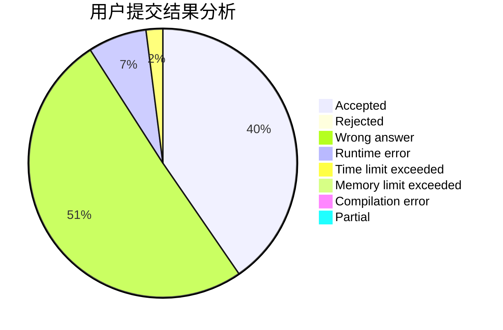
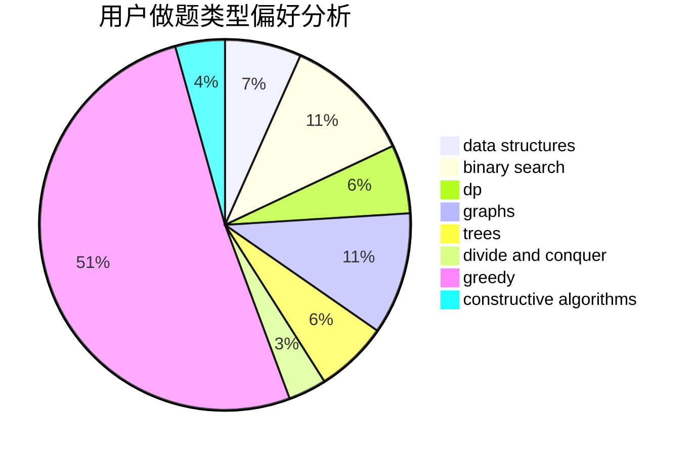
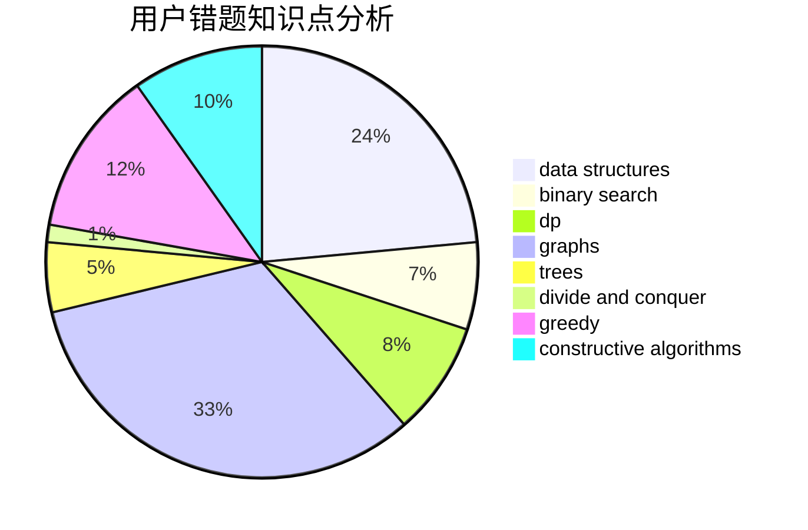

# xyizd

<!-- tabs:start -->

#### **用户提交结果分析**

#### **用户做题类型偏好分析**

#### **用户错题知识点分析**

<!-- tabs:end -->
# 推荐题目
[1328F](https://codeforces.com/contest/1328/problem/F)		greedy		  
[677A](https://codeforces.com/contest/677/problem/A)		implementation		  
[895D](https://codeforces.com/contest/895/problem/D)		combinatorics,
                        math,
                        strings		  
[1505B](https://codeforces.com/contest/1505/problem/B)		implementation,
                        number theory		  
[559E](https://codeforces.com/contest/559/problem/E)		dp,
                        sortings		  
[1488A](https://codeforces.com/contest/1488/problem/A)		*special problem,
                        math		  
[1380E](https://codeforces.com/contest/1380/problem/E)		data structures,
                        dsu,
                        implementation,
                        trees		  
[1179B](https://codeforces.com/contest/1179/problem/B)		constructive algorithms		  
[828E](https://codeforces.com/contest/828/problem/E)		dsu,graphs,sortings,trees		  
[637B](https://codeforces.com/contest/637/problem/B)		*special problem,
                        binary search,
                        constructive algorithms,
                        data structures,
                        sortings		  
