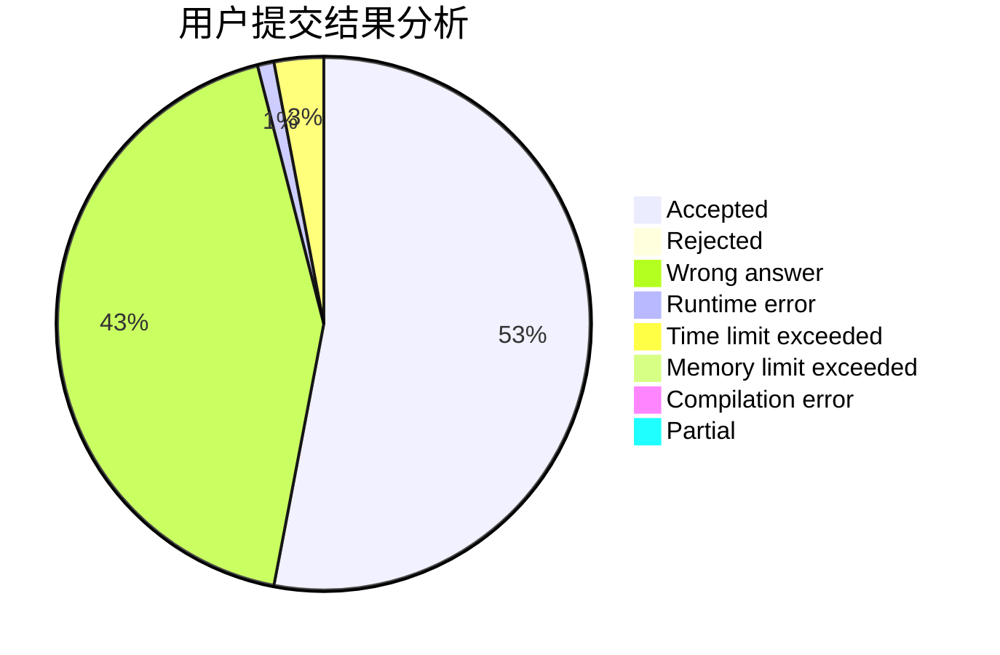
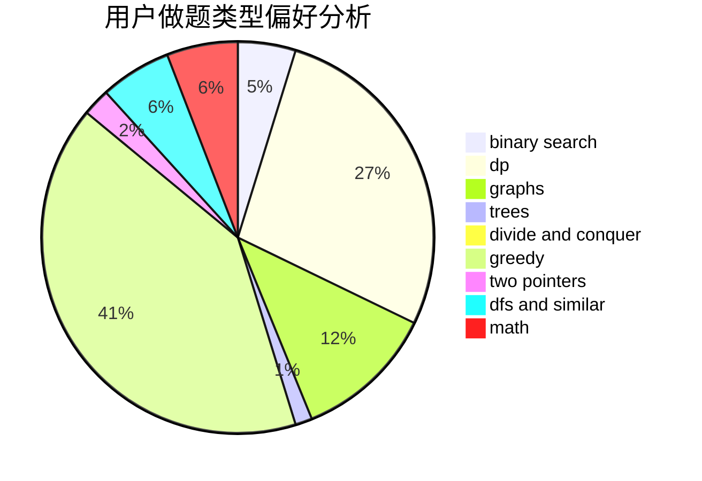

# xyq0220

<!-- tabs:start -->

#### **用户提交结果分析**

#### **用户做题类型偏好分析**

<!-- tabs:end -->
# 推荐题目
[9A](https://codeforces.com/contest/9/problem/A)
[1139A](https://codeforces.com/contest/1139/problem/A)
[1304C](https://codeforces.com/contest/1304/problem/C)
[482E](https://codeforces.com/contest/482/problem/E)
[231A](https://codeforces.com/contest/231/problem/A)
[623A](https://codeforces.com/contest/623/problem/A)
[106B](https://codeforces.com/contest/106/problem/B)
[1311F](https://codeforces.com/contest/1311/problem/F)
[795D](https://codeforces.com/contest/795/problem/D)
[134B](https://codeforces.com/contest/134/problem/B)
