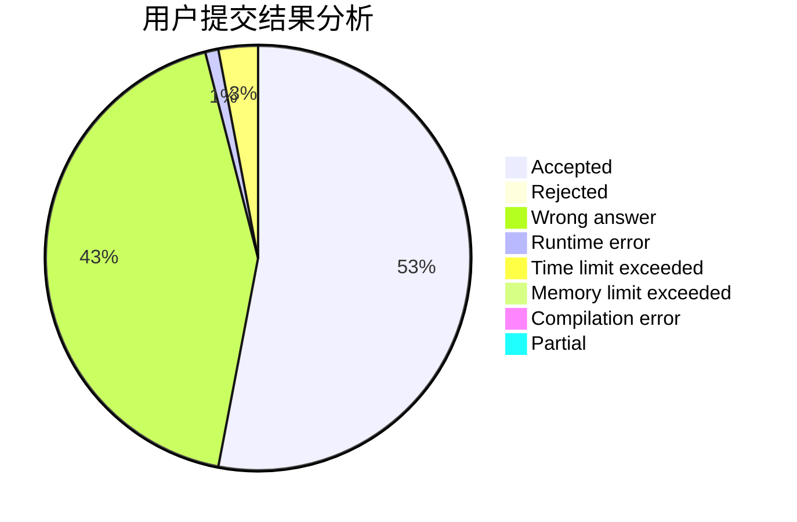
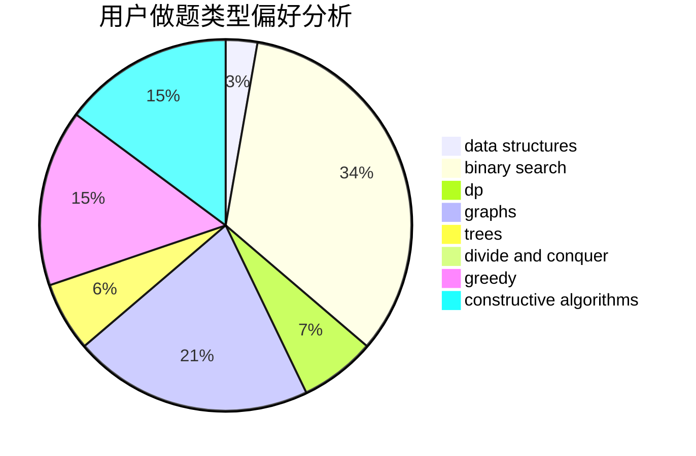
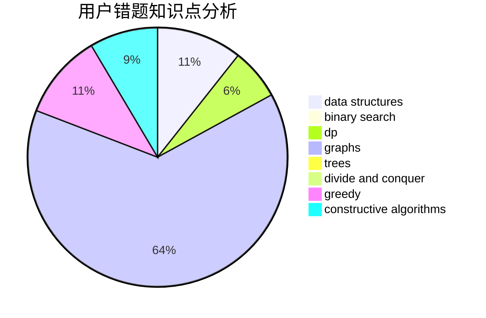

# xyq0220

<!-- tabs:start -->

#### **用户提交结果分析**

#### **用户做题类型偏好分析**

#### **用户错题知识点分析**

<!-- tabs:end -->
# 推荐题目
[985A](https://codeforces.com/contest/985/problem/A)		implementation		  
[1136E](https://codeforces.com/contest/1136/problem/E)		binary search,
                        data structures		  
[1297C](https://codeforces.com/contest/1297/problem/C)		*special problem,
                        greedy		  
[463A](https://codeforces.com/contest/463/problem/A)		brute force,
                        implementation		  
[208E](https://codeforces.com/contest/208/problem/E)		binary search,
                        data structures,
                        dfs and similar,
                        trees		  
[605A](https://codeforces.com/contest/605/problem/A)		constructive algorithms,
                        greedy		  
[1068D](https://codeforces.com/contest/1068/problem/D)		dsu,graphs,sortings,trees		  
[1303B](https://codeforces.com/contest/1303/problem/B)		math		  
[777B](https://codeforces.com/contest/777/problem/B)		data structures,
                        dp,
                        greedy,
                        sortings		  
[1343B](https://codeforces.com/contest/1343/problem/B)		constructive algorithms,
                        math		  
