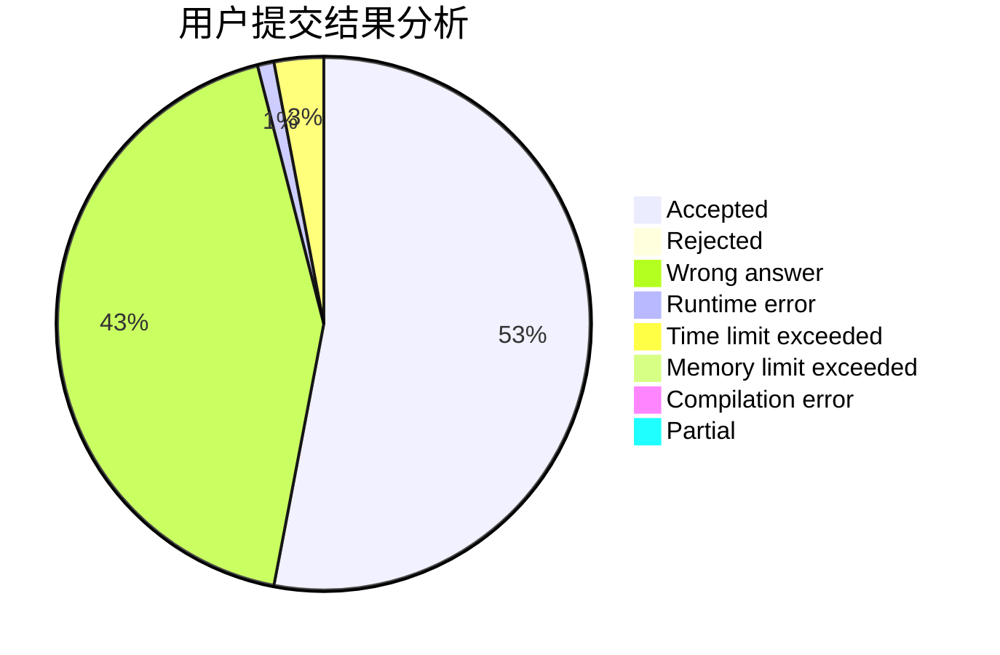
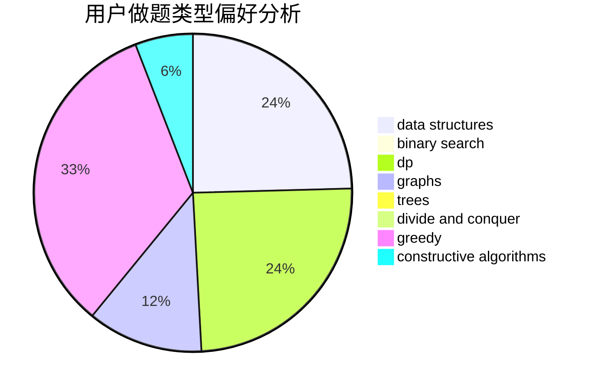
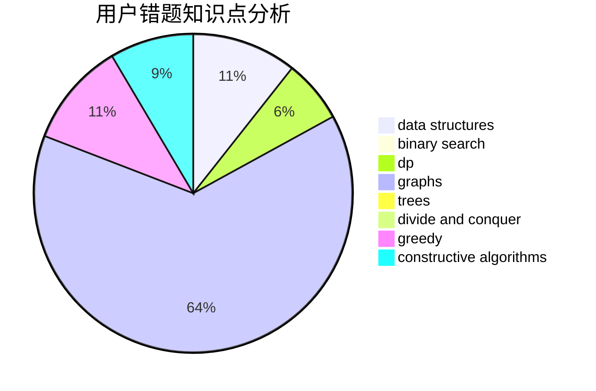

# xyq0220

<!-- tabs:start -->

#### **用户提交结果分析**

#### **用户做题类型偏好分析**

#### **用户错题知识点分析**

<!-- tabs:end -->
# 推荐题目
[9A](https://codeforces.com/contest/9/problem/A)		math,
                        probabilities		  
[1139A](https://codeforces.com/contest/1139/problem/A)		implementation,
                        strings		  
[1304C](https://codeforces.com/contest/1304/problem/C)		dp,
                        greedy,
                        implementation,
                        sortings,
                        two pointers		  
[482E](https://codeforces.com/contest/482/problem/E)		data structures,
                        trees		  
[231A](https://codeforces.com/contest/231/problem/A)		brute force,
                        greedy		  
[623A](https://codeforces.com/contest/623/problem/A)		constructive algorithms,
                        graphs		  
[106B](https://codeforces.com/contest/106/problem/B)		brute force,
                        implementation		  
[1311F](https://codeforces.com/contest/1311/problem/F)		data structures,
                        divide and conquer,
                        implementation,
                        sortings		  
[795D](https://codeforces.com/contest/795/problem/D)		dsu,graphs,sortings,trees		  
[134B](https://codeforces.com/contest/134/problem/B)		brute force,
                        dfs and similar,
                        math,
                        number theory		  
