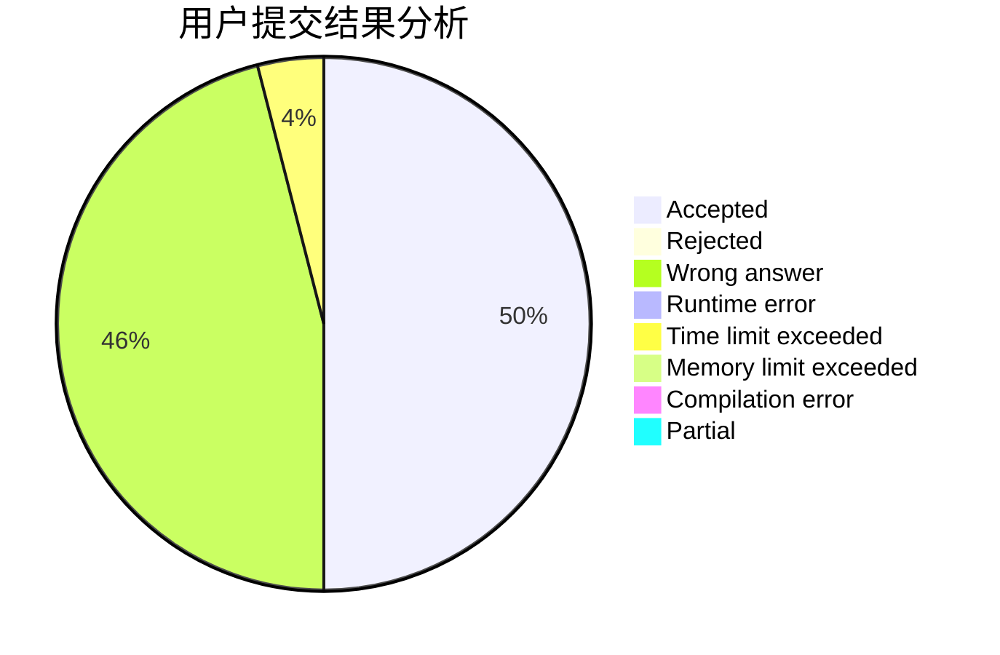
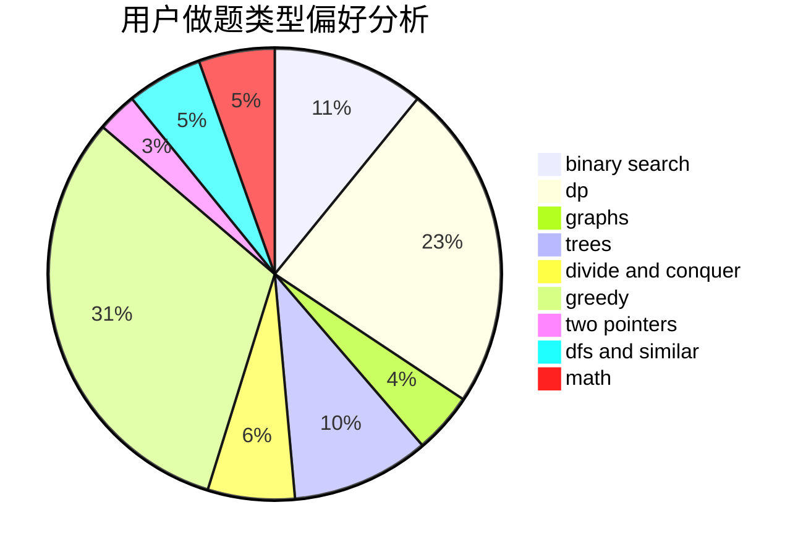

# CathyChan

<!-- tabs:start -->

#### **用户提交结果分析**

#### **用户做题类型偏好分析**

<!-- tabs:end -->
# 推荐题目
[1340A](https://codeforces.com/contest/1340/problem/A)
[1333F](https://codeforces.com/contest/1333/problem/F)
[1223A](https://codeforces.com/contest/1223/problem/A)
[509C](https://codeforces.com/contest/509/problem/C)
[681A](https://codeforces.com/contest/681/problem/A)
[1439D](https://codeforces.com/contest/1439/problem/D)
[421B](https://codeforces.com/contest/421/problem/B)
[1358F](https://codeforces.com/contest/1358/problem/F)
[680B](https://codeforces.com/contest/680/problem/B)
[1093E](https://codeforces.com/contest/1093/problem/E)
