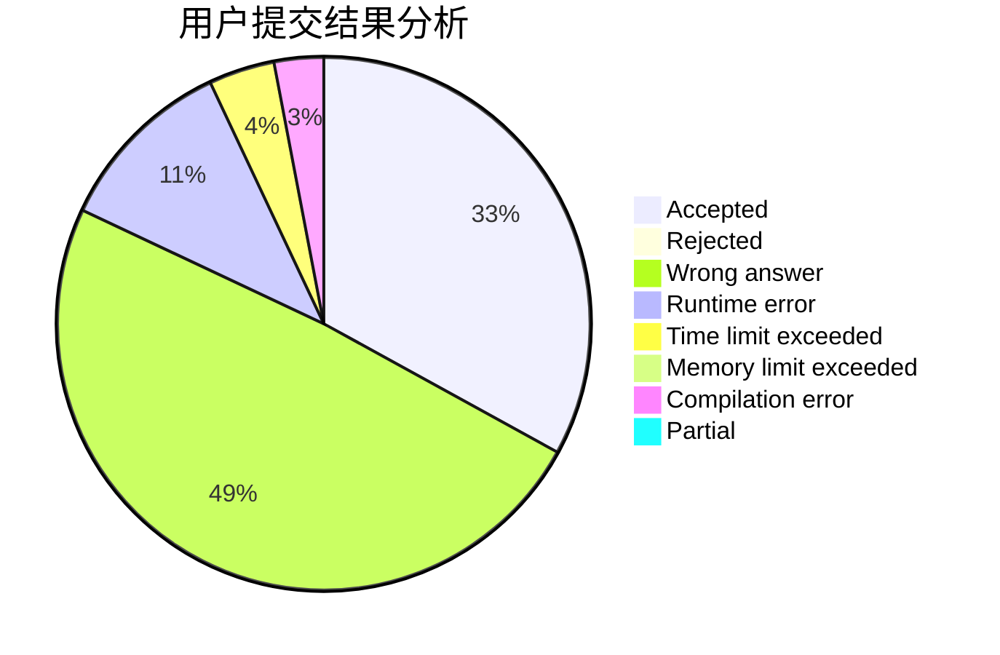
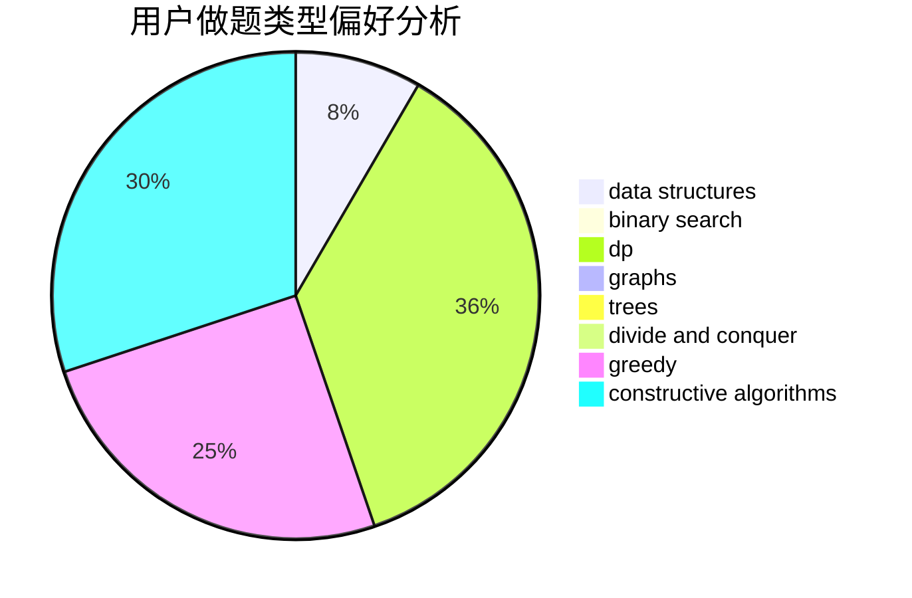
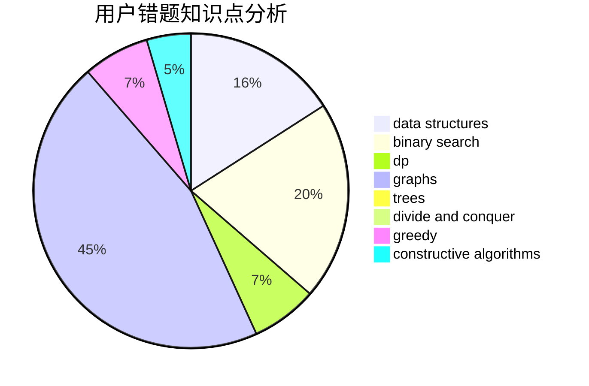

# xyw5vplus1

<!-- tabs:start -->

#### **用户提交结果分析**

#### **用户做题类型偏好分析**

#### **用户错题知识点分析**

<!-- tabs:end -->
# 推荐题目
[1225A](https://codeforces.com/contest/1225/problem/A)		math		  
[864F](https://codeforces.com/contest/864/problem/F)		dfs and similar,
                        graphs,
                        trees		  
[218C](https://codeforces.com/contest/218/problem/C)		dsu,graphs,sortings,trees		  
[886C](https://codeforces.com/contest/886/problem/C)		dsu,
                        greedy,
                        implementation,
                        trees		  
[11412](https://codeforces.com/contest/1141/problem/2)		dsu,graphs,sortings,trees		  
[38B](https://codeforces.com/contest/38/problem/B)		brute force,
                        implementation,
                        math		  
[846B](https://codeforces.com/contest/846/problem/B)		brute force,
                        greedy		  
[676E](https://codeforces.com/contest/676/problem/E)		math		  
[784B](https://codeforces.com/contest/784/problem/B)		*special problem		  
[878A](https://codeforces.com/contest/878/problem/A)		bitmasks,
                        constructive algorithms		  
