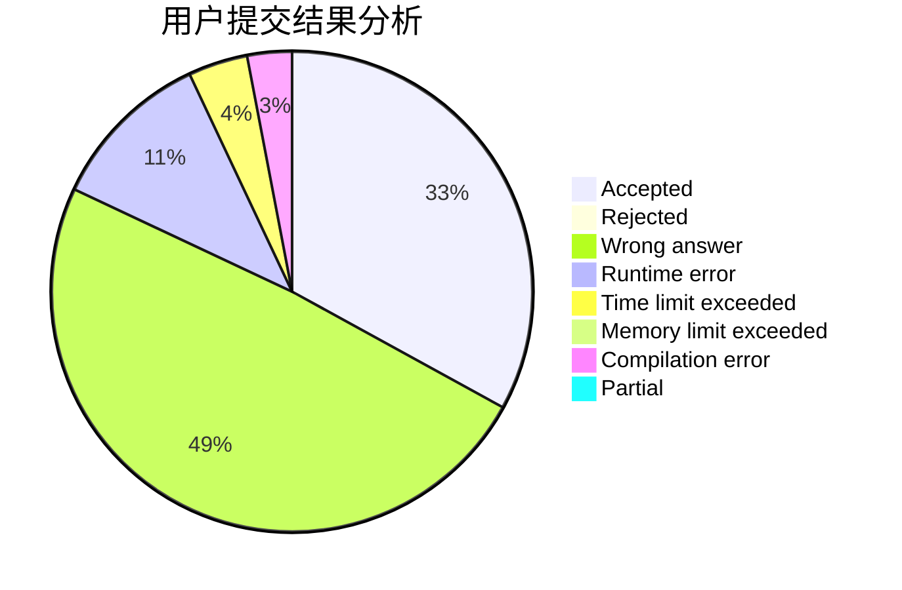
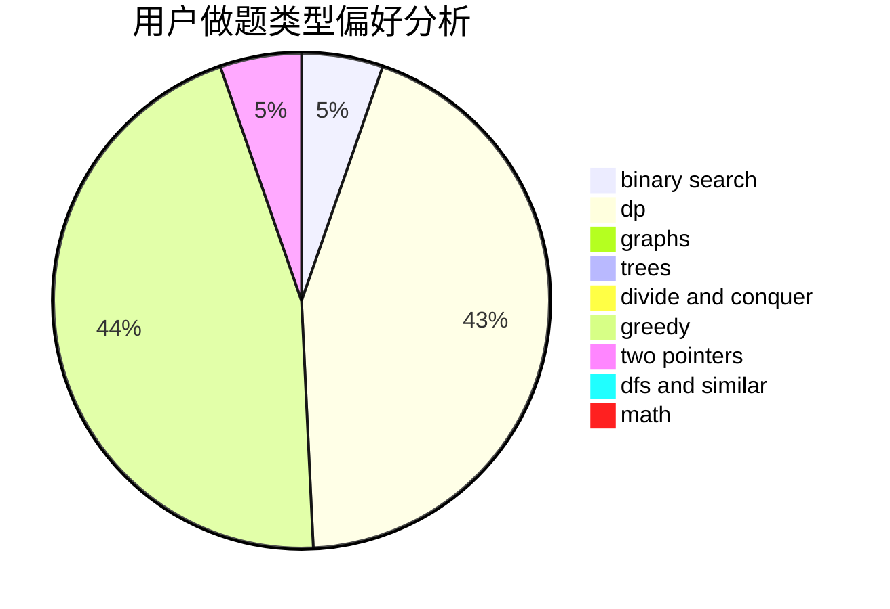

# xyw5vplus1

<!-- tabs:start -->

#### **用户提交结果分析**

#### **用户做题类型偏好分析**

<!-- tabs:end -->
# 推荐题目
[1225A](https://codeforces.com/contest/1225/problem/A)
[864F](https://codeforces.com/contest/864/problem/F)
[218C](https://codeforces.com/contest/218/problem/C)
[886C](https://codeforces.com/contest/886/problem/C)
[11412](https://codeforces.com/contest/1141/problem/2)
[38B](https://codeforces.com/contest/38/problem/B)
[846B](https://codeforces.com/contest/846/problem/B)
[676E](https://codeforces.com/contest/676/problem/E)
[784B](https://codeforces.com/contest/784/problem/B)
[878A](https://codeforces.com/contest/878/problem/A)
