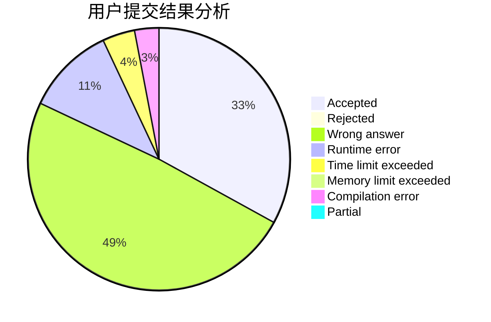
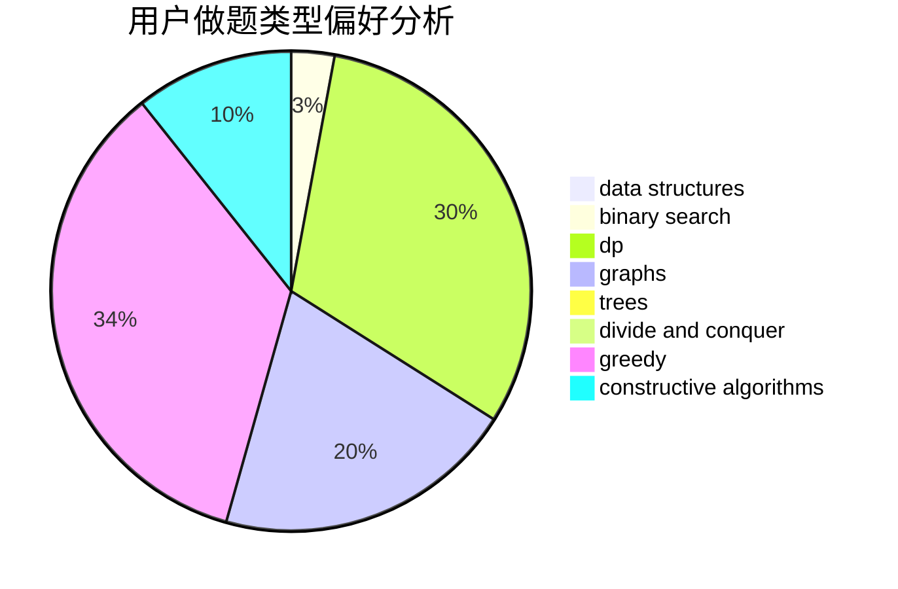
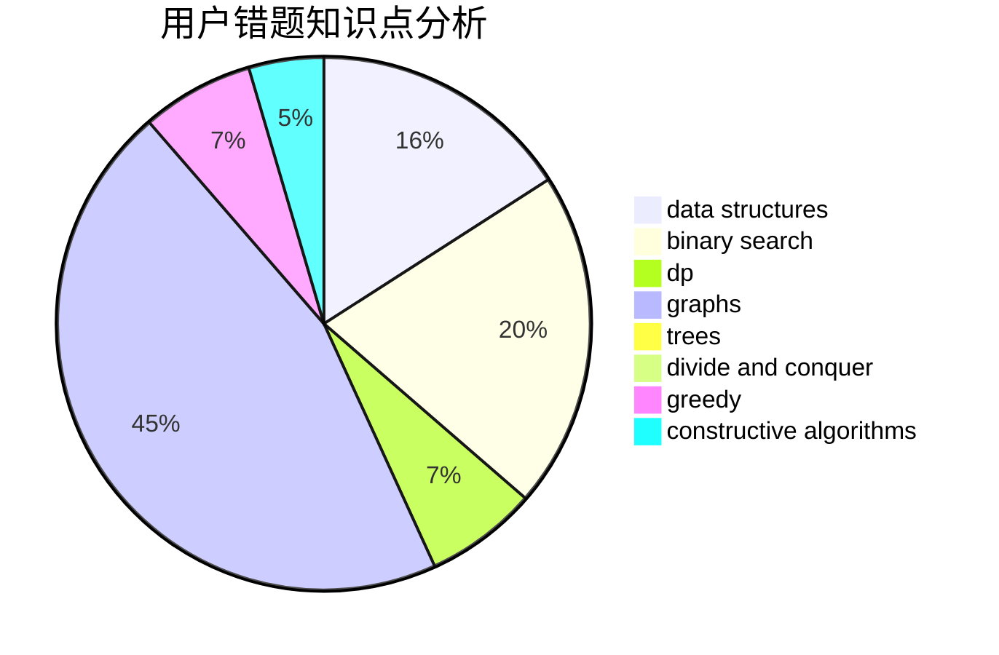

# xyw5vplus1

<!-- tabs:start -->

#### **用户提交结果分析**

#### **用户做题类型偏好分析**

#### **用户错题知识点分析**

<!-- tabs:end -->
# 推荐题目
[1217D](https://codeforces.com/contest/1217/problem/D)		constructive algorithms,
                        dfs and similar,
                        graphs		  
[846E](https://codeforces.com/contest/846/problem/E)		dfs and similar,
                        greedy,
                        trees		  
[195C](https://codeforces.com/contest/195/problem/C)		expression parsing,
                        implementation		  
[865G](https://codeforces.com/contest/865/problem/G)		combinatorics,
                        math,
                        matrices		  
[1139E](https://codeforces.com/contest/1139/problem/E)		flows,
                        graph matchings,
                        graphs		  
[363C](https://codeforces.com/contest/363/problem/C)		greedy,
                        implementation		  
[827F](https://codeforces.com/contest/827/problem/F)		data structures,
                        dp,
                        graphs,
                        shortest paths		  
[652F](https://codeforces.com/contest/652/problem/F)		constructive algorithms,
                        math		  
[764D](https://codeforces.com/contest/764/problem/D)		dsu,graphs,sortings,trees		  
[860A](https://codeforces.com/contest/860/problem/A)		dsu,graphs,sortings,trees		  
