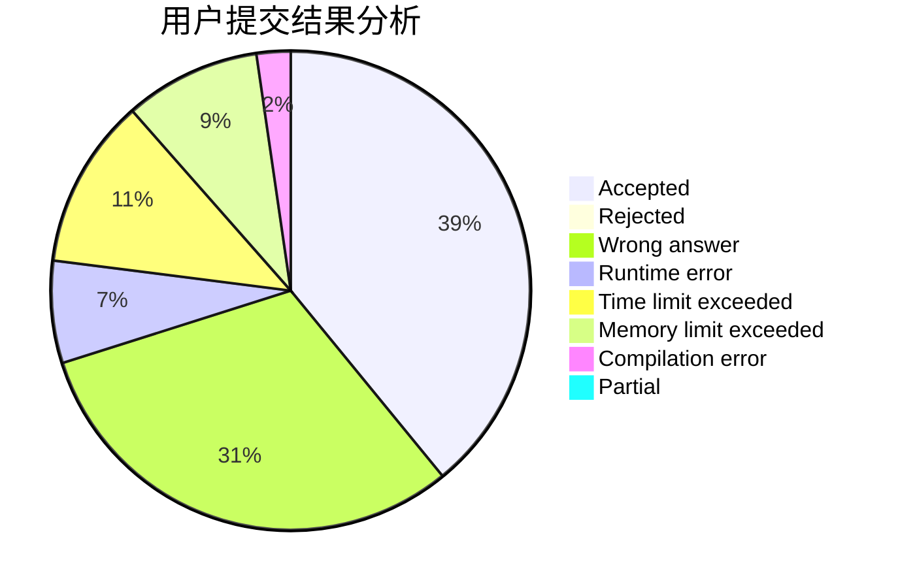
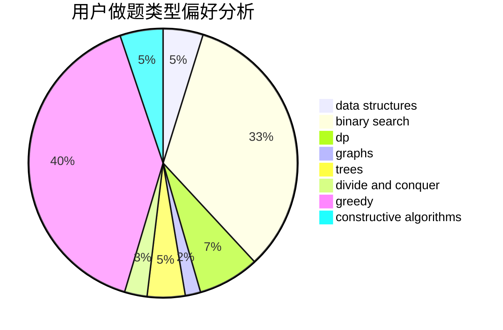
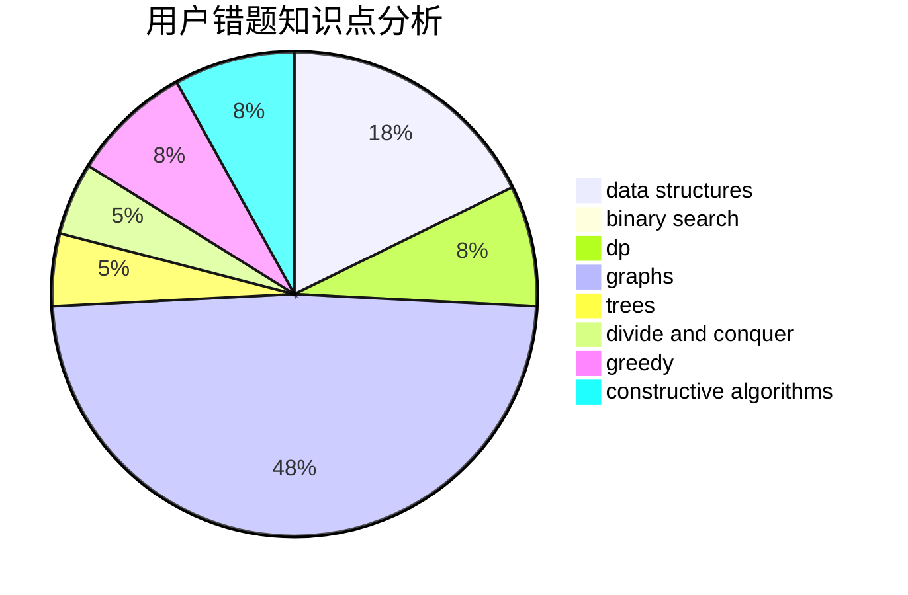

# xzc1462476229

<!-- tabs:start -->

#### **用户提交结果分析**

#### **用户做题类型偏好分析**

#### **用户错题知识点分析**

<!-- tabs:end -->
# 推荐题目
[1166F](https://codeforces.com/contest/1166/problem/F)		data structures,
                        dsu,
                        graphs,
                        hashing		  
[421A](https://codeforces.com/contest/421/problem/A)		constructive algorithms,
                        implementation		  
[1092E](https://codeforces.com/contest/1092/problem/E)		constructive algorithms,
                        dfs and similar,
                        greedy,
                        trees		  
[1113B](https://codeforces.com/contest/1113/problem/B)		greedy,
                        number theory		  
[1101E](https://codeforces.com/contest/1101/problem/E)		implementation		  
[1059A](https://codeforces.com/contest/1059/problem/A)		implementation		  
[243A](https://codeforces.com/contest/243/problem/A)		bitmasks		  
[723A](https://codeforces.com/contest/723/problem/A)		implementation,
                        math,
                        sortings		  
[938D](https://codeforces.com/contest/938/problem/D)		data structures,
                        graphs,
                        shortest paths		  
[765C](https://codeforces.com/contest/765/problem/C)		math		  
