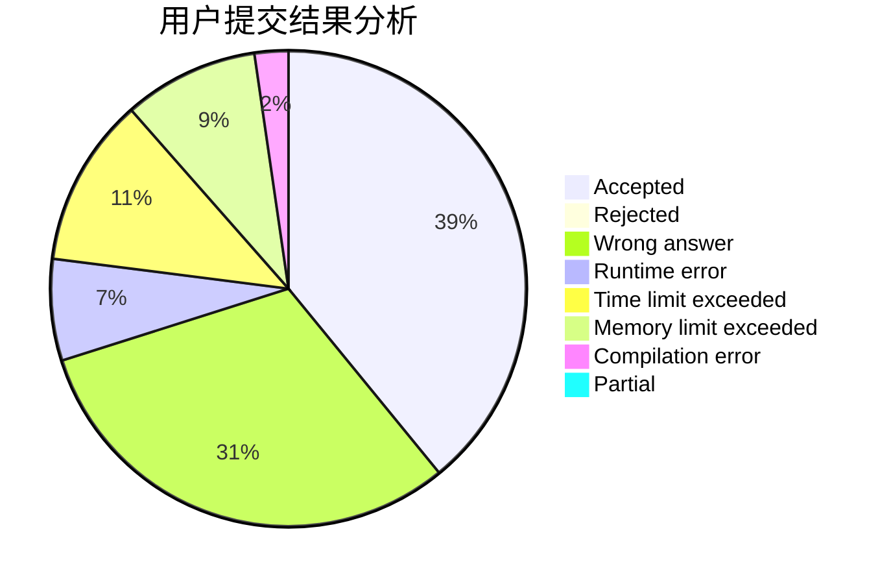
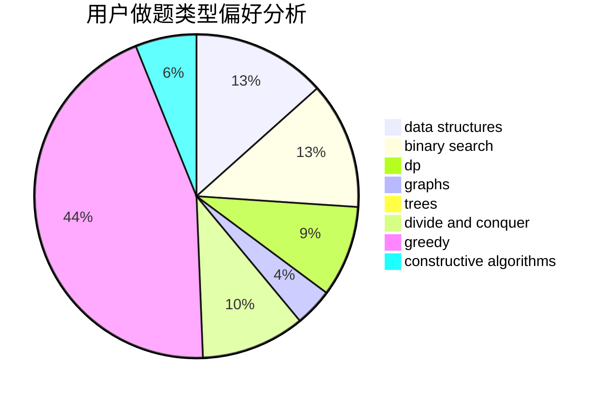
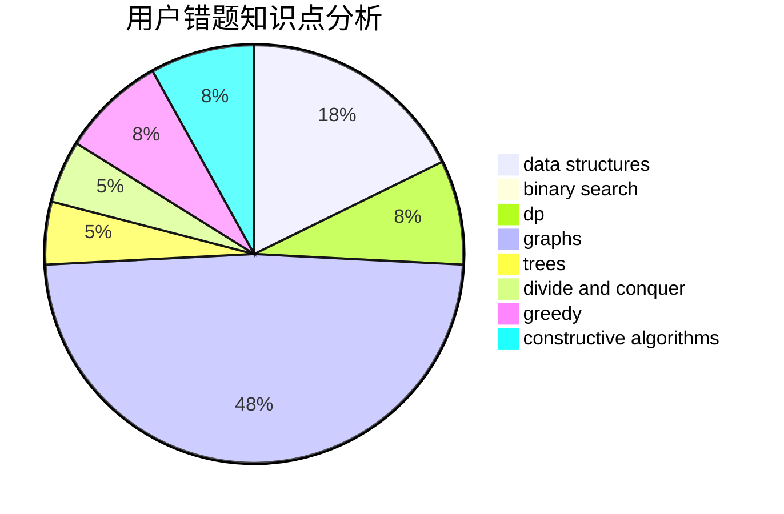

# xzc1462476229

<!-- tabs:start -->

#### **用户提交结果分析**

#### **用户做题类型偏好分析**

#### **用户错题知识点分析**

<!-- tabs:end -->
# 推荐题目
[1164P](https://codeforces.com/contest/1164/problem/P)		dsu,graphs,sortings,trees		  
[392B](https://codeforces.com/contest/392/problem/B)		dp		  
[1092B](https://codeforces.com/contest/1092/problem/B)		sortings		  
[1111C](https://codeforces.com/contest/1111/problem/C)		binary search,
                        brute force,
                        divide and conquer,
                        math		  
[1101B](https://codeforces.com/contest/1101/problem/B)		greedy,
                        implementation		  
[1058C](https://codeforces.com/contest/1058/problem/C)		dsu,graphs,sortings,trees		  
[224A](https://codeforces.com/contest/224/problem/A)		brute force,
                        geometry,
                        math		  
[703E](https://codeforces.com/contest/703/problem/E)		dp,
                        number theory		  
[918A](https://codeforces.com/contest/918/problem/A)		brute force,
                        implementation		  
[746A](https://codeforces.com/contest/746/problem/A)		implementation,
                        math		  
