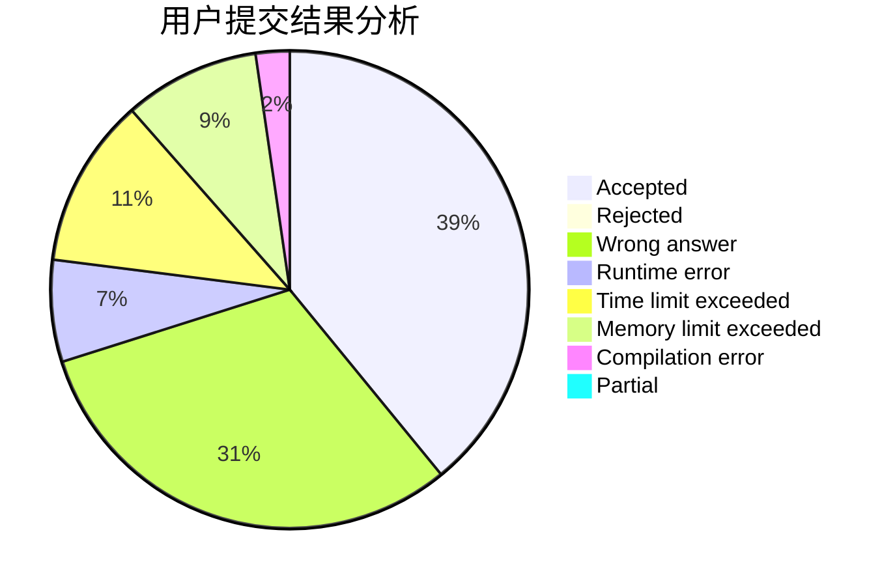
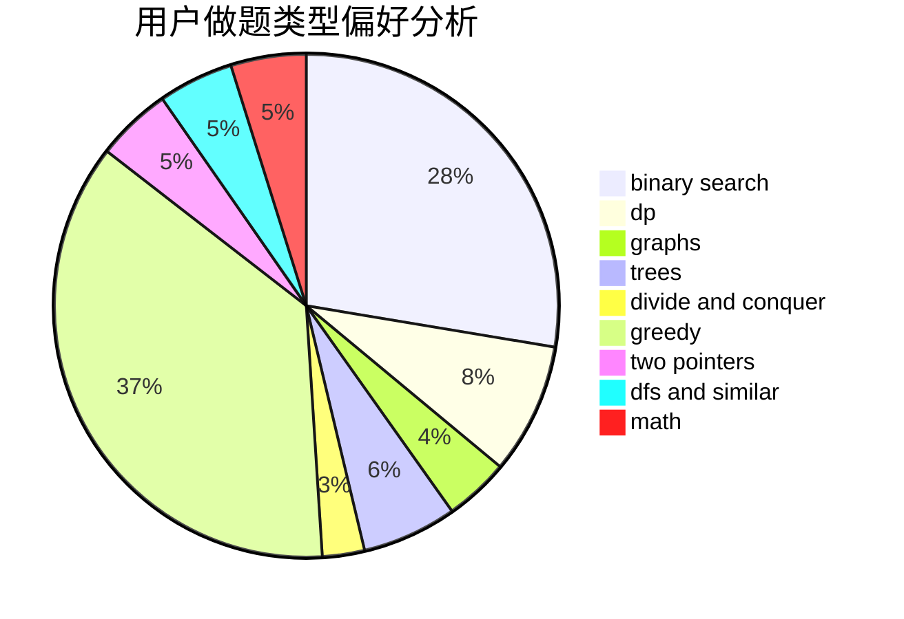

# xzc1462476229

<!-- tabs:start -->

#### **用户提交结果分析**

#### **用户做题类型偏好分析**

<!-- tabs:end -->
# 推荐题目
[1166F](https://codeforces.com/contest/1166/problem/F)
[421A](https://codeforces.com/contest/421/problem/A)
[1092E](https://codeforces.com/contest/1092/problem/E)
[1113B](https://codeforces.com/contest/1113/problem/B)
[1101E](https://codeforces.com/contest/1101/problem/E)
[1059A](https://codeforces.com/contest/1059/problem/A)
[243A](https://codeforces.com/contest/243/problem/A)
[723A](https://codeforces.com/contest/723/problem/A)
[938D](https://codeforces.com/contest/938/problem/D)
[765C](https://codeforces.com/contest/765/problem/C)
