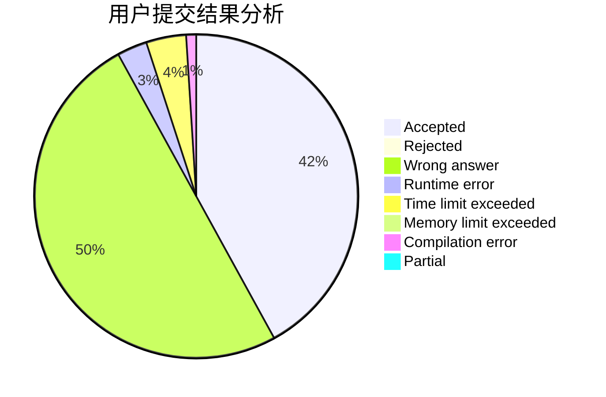
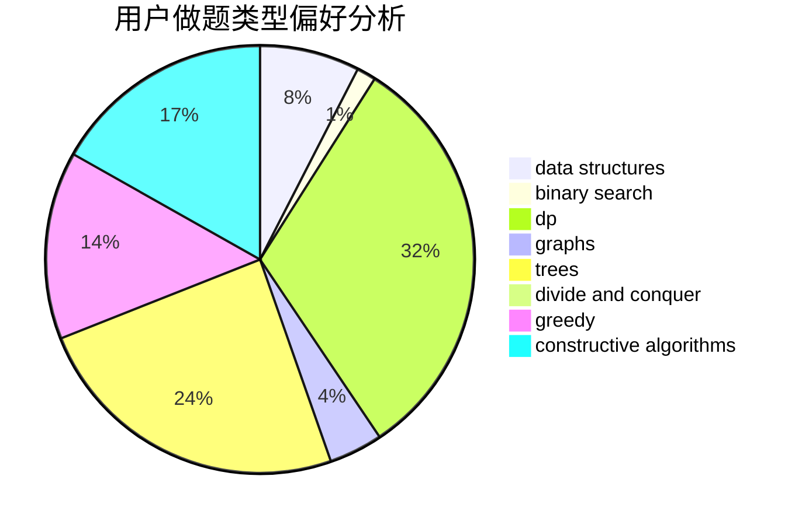
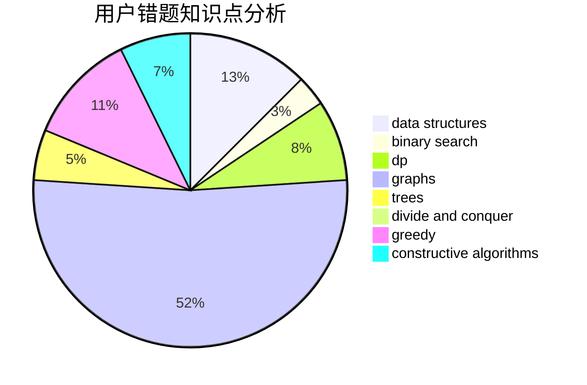

# xzm2021

<!-- tabs:start -->

#### **用户提交结果分析**

#### **用户做题类型偏好分析**

#### **用户错题知识点分析**

<!-- tabs:end -->
# 推荐题目
[1200E](https://codeforces.com/contest/1200/problem/E)		brute force,
                        hashing,
                        implementation,
                        string suffix structures,
                        strings		  
[1315F](https://codeforces.com/contest/1315/problem/F)		dsu,graphs,sortings,trees		  
[1131F](https://codeforces.com/contest/1131/problem/F)		constructive algorithms,
                        dsu		  
[877C](https://codeforces.com/contest/877/problem/C)		constructive algorithms		  
[938A](https://codeforces.com/contest/938/problem/A)		implementation		  
[863E](https://codeforces.com/contest/863/problem/E)		data structures,
                        sortings		  
[887F](https://codeforces.com/contest/887/problem/F)		greedy,
                        sortings		  
[960B](https://codeforces.com/contest/960/problem/B)		data structures,
                        greedy,
                        sortings		  
[500B](https://codeforces.com/contest/500/problem/B)		dfs and similar,
                        dsu,
                        graphs,
                        greedy,
                        math,
                        sortings		  
[1037B](https://codeforces.com/contest/1037/problem/B)		greedy		  
