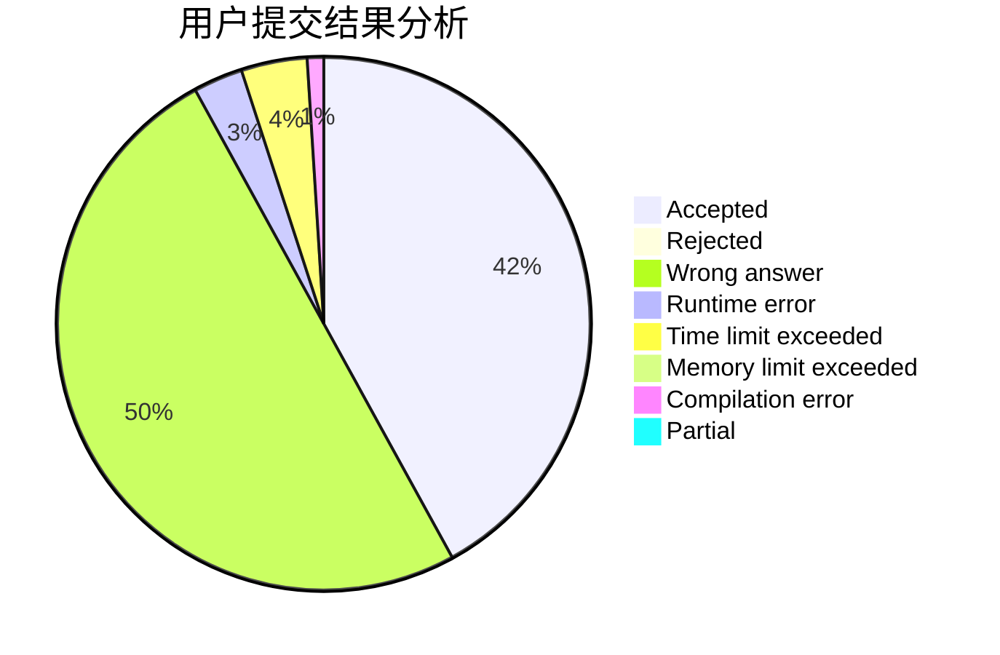
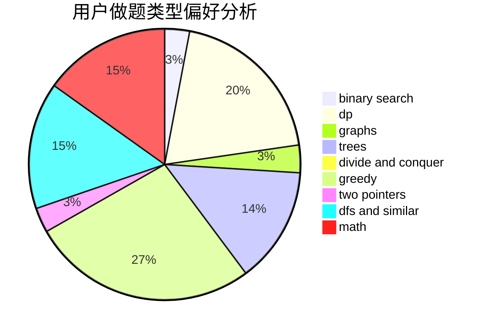

# xzm2021

<!-- tabs:start -->

#### **用户提交结果分析**

#### **用户做题类型偏好分析**

<!-- tabs:end -->
# 推荐题目
[1200E](https://codeforces.com/contest/1200/problem/E)
[1315F](https://codeforces.com/contest/1315/problem/F)
[1131F](https://codeforces.com/contest/1131/problem/F)
[877C](https://codeforces.com/contest/877/problem/C)
[938A](https://codeforces.com/contest/938/problem/A)
[863E](https://codeforces.com/contest/863/problem/E)
[887F](https://codeforces.com/contest/887/problem/F)
[960B](https://codeforces.com/contest/960/problem/B)
[500B](https://codeforces.com/contest/500/problem/B)
[1037B](https://codeforces.com/contest/1037/problem/B)
