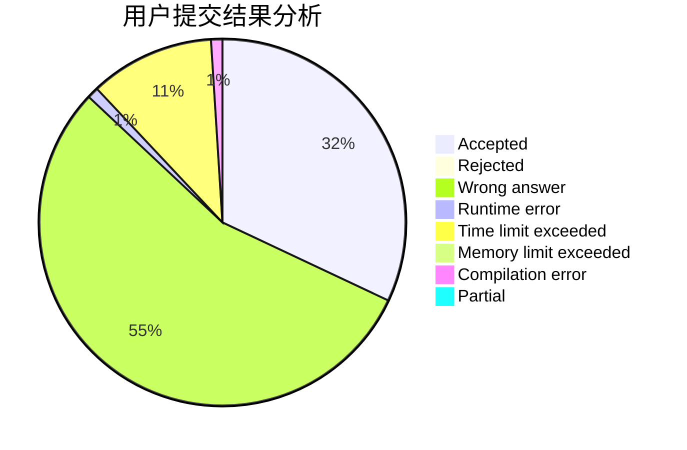
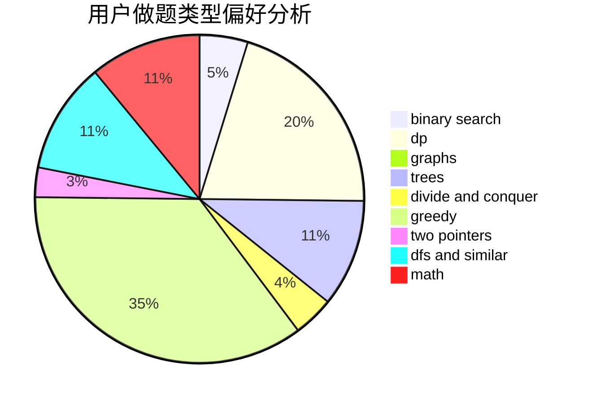

# xzmy

<!-- tabs:start -->

#### **用户提交结果分析**

#### **用户做题类型偏好分析**

<!-- tabs:end -->
# 推荐题目
[1280E](https://codeforces.com/contest/1280/problem/E)
[12621](https://codeforces.com/contest/1262/problem/1)
[1248E](https://codeforces.com/contest/1248/problem/E)
[411A](https://codeforces.com/contest/411/problem/A)
[574B](https://codeforces.com/contest/574/problem/B)
[730E](https://codeforces.com/contest/730/problem/E)
[744C](https://codeforces.com/contest/744/problem/C)
[553B](https://codeforces.com/contest/553/problem/B)
[1298B](https://codeforces.com/contest/1298/problem/B)
[486A](https://codeforces.com/contest/486/problem/A)
