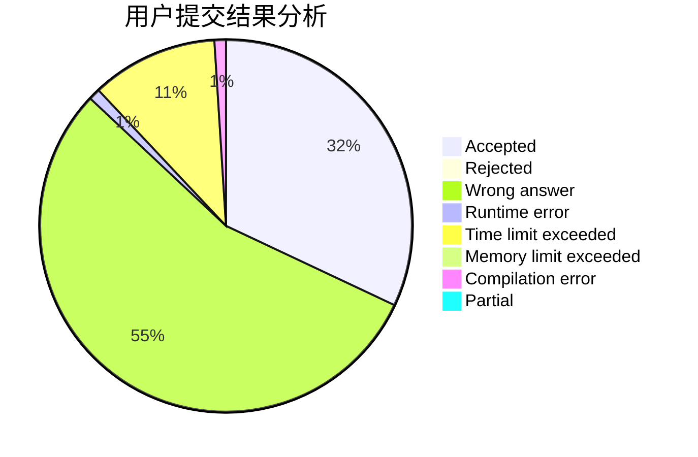
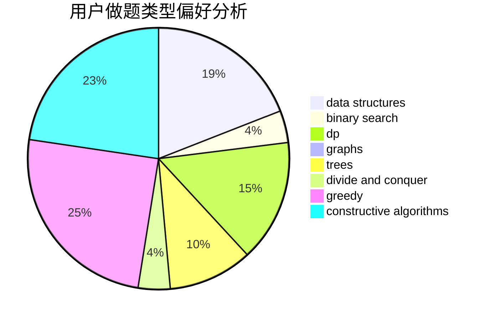

# xzmy

<!-- tabs:start -->

#### **用户提交结果分析**

#### **用户做题类型偏好分析**

#### **用户错题知识点分析**

<!-- tabs:end -->
# 推荐题目
[1280E](https://codeforces.com/contest/1280/problem/E)		math		  
[12621](https://codeforces.com/contest/1262/problem/1)		dsu,graphs,sortings,trees		  
[1248E](https://codeforces.com/contest/1248/problem/E)		dsu,graphs,sortings,trees		  
[411A](https://codeforces.com/contest/411/problem/A)		*special problem,
                        implementation		  
[574B](https://codeforces.com/contest/574/problem/B)		brute force,
                        dfs and similar,
                        graphs,
                        hashing		  
[730E](https://codeforces.com/contest/730/problem/E)		greedy,
                        implementation		  
[744C](https://codeforces.com/contest/744/problem/C)		bitmasks,
                        brute force,
                        dp		  
[553B](https://codeforces.com/contest/553/problem/B)		binary search,
                        combinatorics,
                        constructive algorithms,
                        greedy,
                        implementation,
                        math		  
[1298B](https://codeforces.com/contest/1298/problem/B)		dsu,graphs,sortings,trees		  
[486A](https://codeforces.com/contest/486/problem/A)		implementation,
                        math		  
