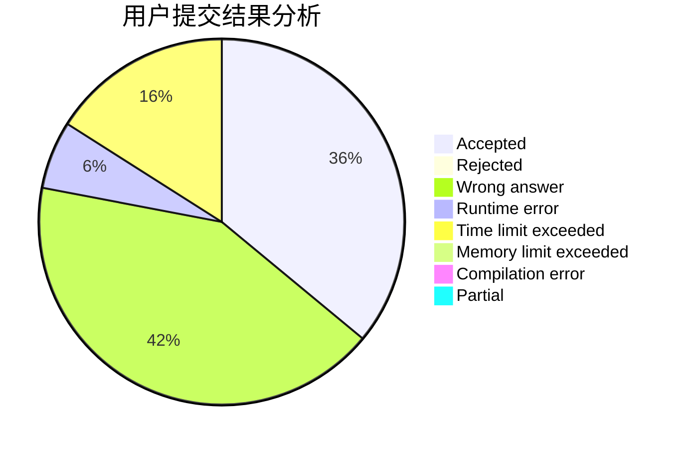
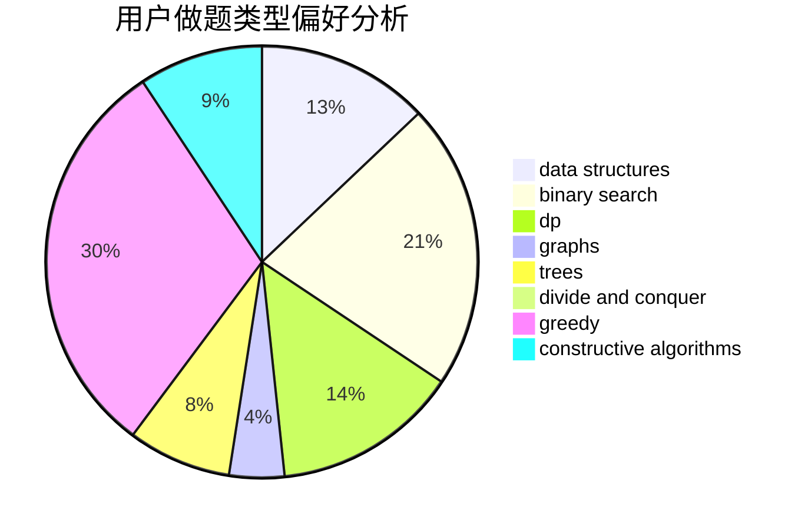
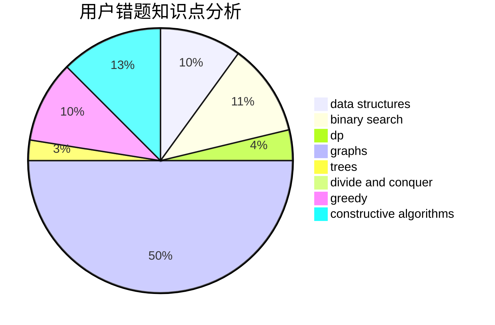

# xzx34

<!-- tabs:start -->

#### **用户提交结果分析**

#### **用户做题类型偏好分析**

#### **用户错题知识点分析**

<!-- tabs:end -->
# 推荐题目
[53E](https://codeforces.com/contest/53/problem/E)		bitmasks,
                        dp		  
[746A](https://codeforces.com/contest/746/problem/A)		implementation,
                        math		  
[1102B](https://codeforces.com/contest/1102/problem/B)		greedy,
                        sortings		  
[777D](https://codeforces.com/contest/777/problem/D)		binary search,
                        greedy,
                        implementation,
                        strings		  
[1107E](https://codeforces.com/contest/1107/problem/E)		dp		  
[845D](https://codeforces.com/contest/845/problem/D)		data structures,
                        dp,
                        greedy		  
[427B](https://codeforces.com/contest/427/problem/B)		data structures,
                        implementation		  
[1438C](https://codeforces.com/contest/1438/problem/C)		2-sat,
                        chinese remainder theorem,
                        constructive algorithms,
                        fft,
                        flows		  
[1363C](https://codeforces.com/contest/1363/problem/C)		games,
                        trees		  
[337C](https://codeforces.com/contest/337/problem/C)		binary search,
                        greedy,
                        math,
                        matrices,
                        number theory		  
