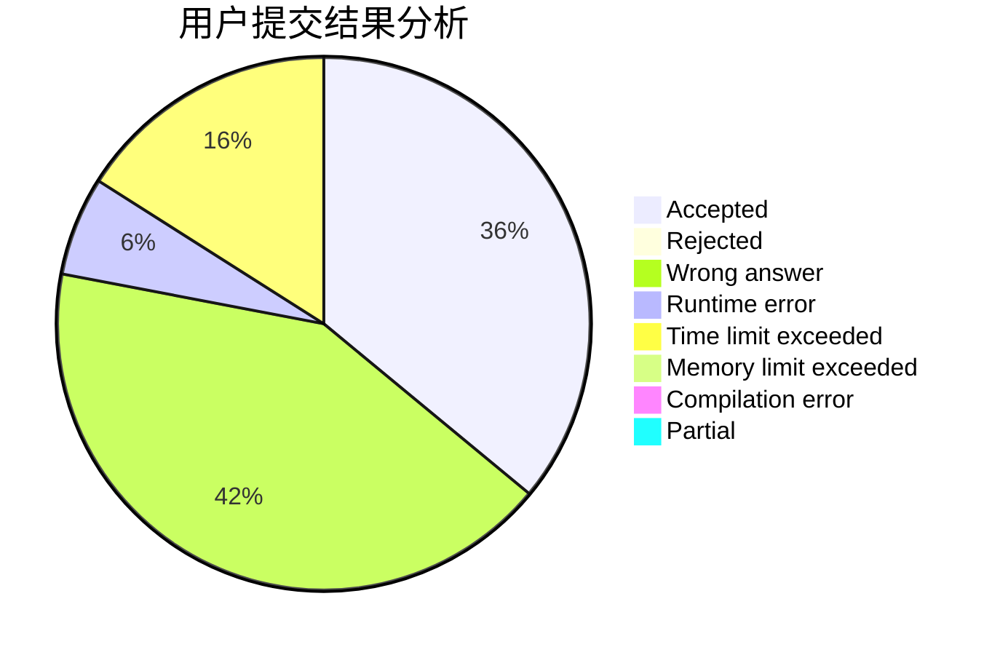
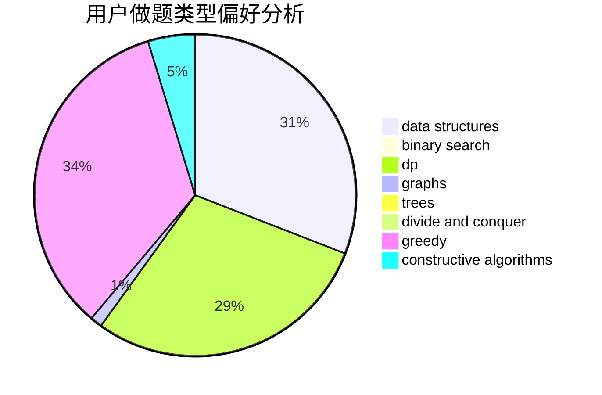
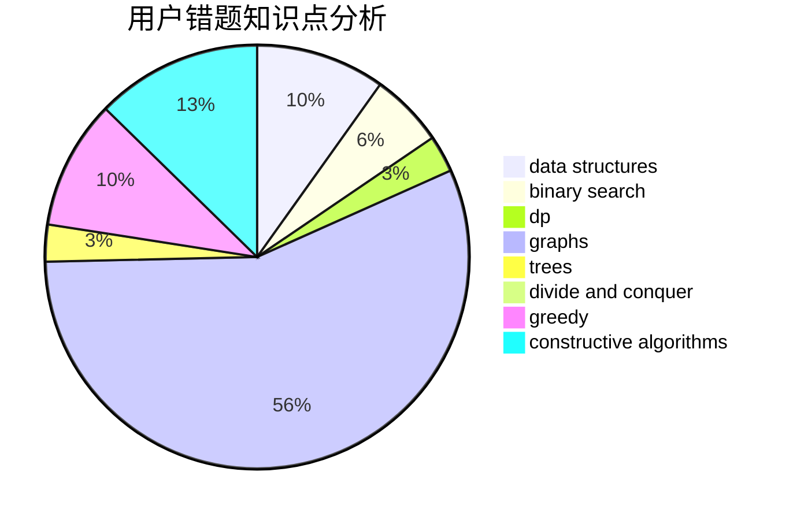

# xzx34

<!-- tabs:start -->

#### **用户提交结果分析**

#### **用户做题类型偏好分析**

#### **用户错题知识点分析**

<!-- tabs:end -->
# 推荐题目
[560E](https://codeforces.com/contest/560/problem/E)		dsu,graphs,sortings,trees		  
[765C](https://codeforces.com/contest/765/problem/C)		math		  
[1102E](https://codeforces.com/contest/1102/problem/E)		combinatorics,
                        sortings		  
[796A](https://codeforces.com/contest/796/problem/A)		brute force,
                        implementation		  
[11082](https://codeforces.com/contest/1108/problem/2)		dsu,graphs,sortings,trees		  
[863E](https://codeforces.com/contest/863/problem/E)		data structures,
                        sortings		  
[44A](https://codeforces.com/contest/44/problem/A)		implementation		  
[144D](https://codeforces.com/contest/144/problem/D)		data structures,
                        dfs and similar,
                        graphs,
                        shortest paths		  
[1370B](https://codeforces.com/contest/1370/problem/B)		constructive algorithms,
                        math,
                        number theory		  
[364A](https://codeforces.com/contest/364/problem/A)		combinatorics,
                        data structures,
                        implementation		  
