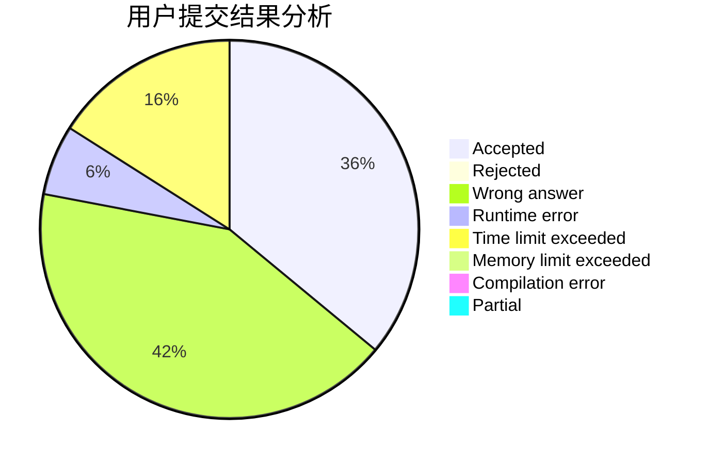
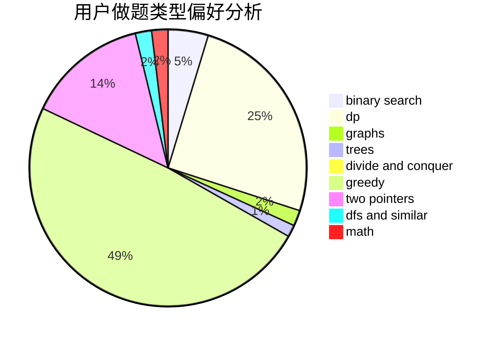

# xzx34

<!-- tabs:start -->

#### **用户提交结果分析**

#### **用户做题类型偏好分析**

<!-- tabs:end -->
# 推荐题目
[560E](https://codeforces.com/contest/560/problem/E)
[765C](https://codeforces.com/contest/765/problem/C)
[1102E](https://codeforces.com/contest/1102/problem/E)
[796A](https://codeforces.com/contest/796/problem/A)
[11082](https://codeforces.com/contest/1108/problem/2)
[863E](https://codeforces.com/contest/863/problem/E)
[44A](https://codeforces.com/contest/44/problem/A)
[144D](https://codeforces.com/contest/144/problem/D)
[1370B](https://codeforces.com/contest/1370/problem/B)
[364A](https://codeforces.com/contest/364/problem/A)
