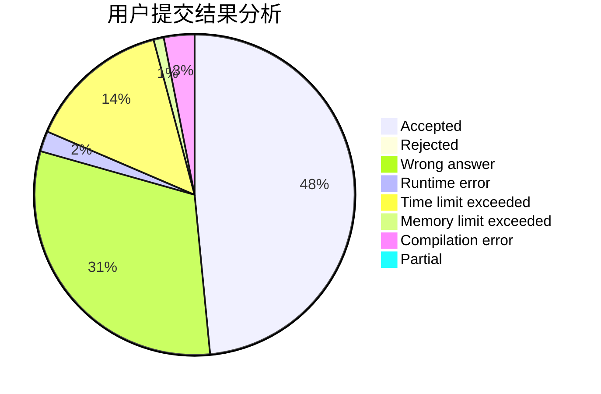
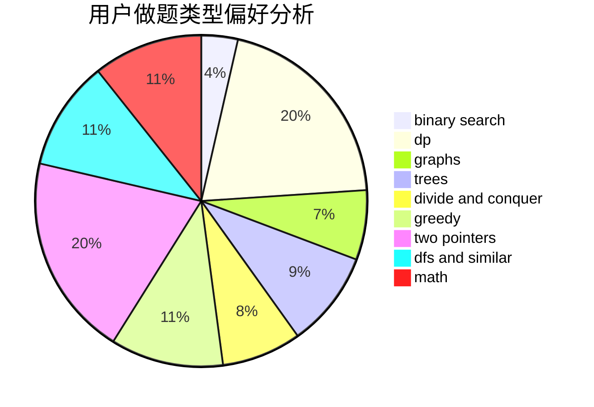

# xzxxzx401

<!-- tabs:start -->

#### **用户提交结果分析**

#### **用户做题类型偏好分析**

<!-- tabs:end -->
# 推荐题目
[314C](https://codeforces.com/contest/314/problem/C)
[1030B](https://codeforces.com/contest/1030/problem/B)
[190C](https://codeforces.com/contest/190/problem/C)
[780B](https://codeforces.com/contest/780/problem/B)
[999D](https://codeforces.com/contest/999/problem/D)
[1341E](https://codeforces.com/contest/1341/problem/E)
[689B](https://codeforces.com/contest/689/problem/B)
[1103B](https://codeforces.com/contest/1103/problem/B)
[483D](https://codeforces.com/contest/483/problem/D)
[811C](https://codeforces.com/contest/811/problem/C)
