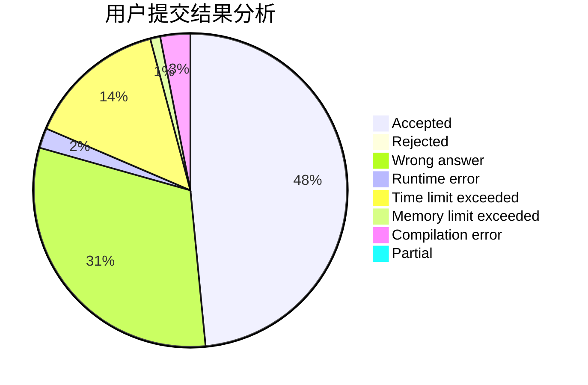
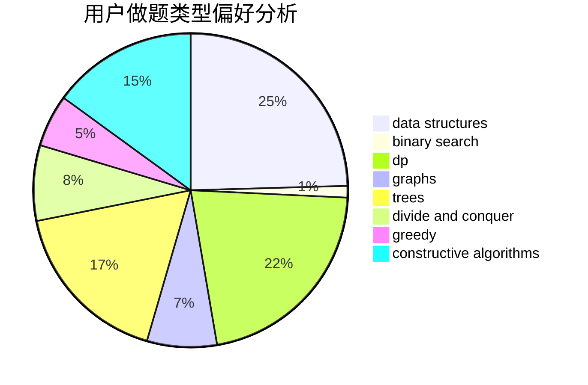
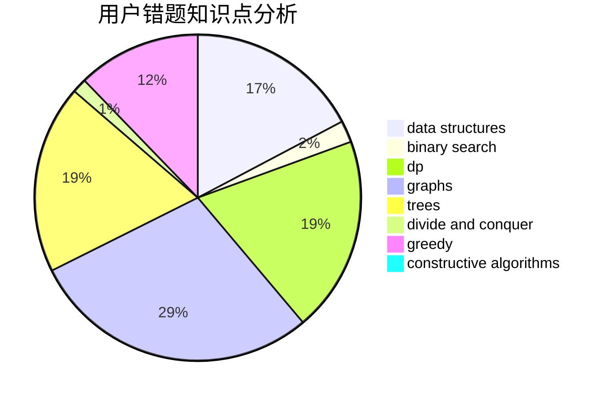

# xzxxzx401

<!-- tabs:start -->

#### **用户提交结果分析**

#### **用户做题类型偏好分析**

#### **用户错题知识点分析**

<!-- tabs:end -->
# 推荐题目
[314C](https://codeforces.com/contest/314/problem/C)		data structures,
                        dp		  
[1030B](https://codeforces.com/contest/1030/problem/B)		geometry		  
[190C](https://codeforces.com/contest/190/problem/C)		dfs and similar		  
[780B](https://codeforces.com/contest/780/problem/B)		binary search		  
[999D](https://codeforces.com/contest/999/problem/D)		data structures,
                        greedy,
                        implementation		  
[1341E](https://codeforces.com/contest/1341/problem/E)		dsu,graphs,sortings,trees		  
[689B](https://codeforces.com/contest/689/problem/B)		dfs and similar,
                        graphs,
                        greedy,
                        shortest paths		  
[1103B](https://codeforces.com/contest/1103/problem/B)		binary search,
                        constructive algorithms,
                        interactive		  
[483D](https://codeforces.com/contest/483/problem/D)		dsu,graphs,sortings,trees		  
[811C](https://codeforces.com/contest/811/problem/C)		dp,
                        implementation		  
