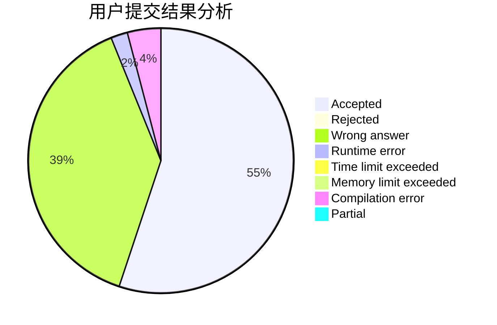
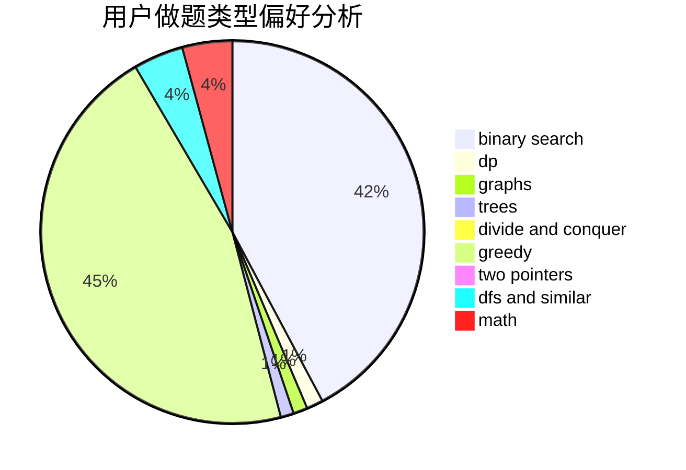

# y0y68

<!-- tabs:start -->

#### **用户提交结果分析**

#### **用户做题类型偏好分析**

<!-- tabs:end -->
# 推荐题目
[429D](https://codeforces.com/contest/429/problem/D)
[558A](https://codeforces.com/contest/558/problem/A)
[1150C](https://codeforces.com/contest/1150/problem/C)
[807C](https://codeforces.com/contest/807/problem/C)
[677B](https://codeforces.com/contest/677/problem/B)
[478B](https://codeforces.com/contest/478/problem/B)
[825G](https://codeforces.com/contest/825/problem/G)
[118C](https://codeforces.com/contest/118/problem/C)
[670A](https://codeforces.com/contest/670/problem/A)
[900C](https://codeforces.com/contest/900/problem/C)
