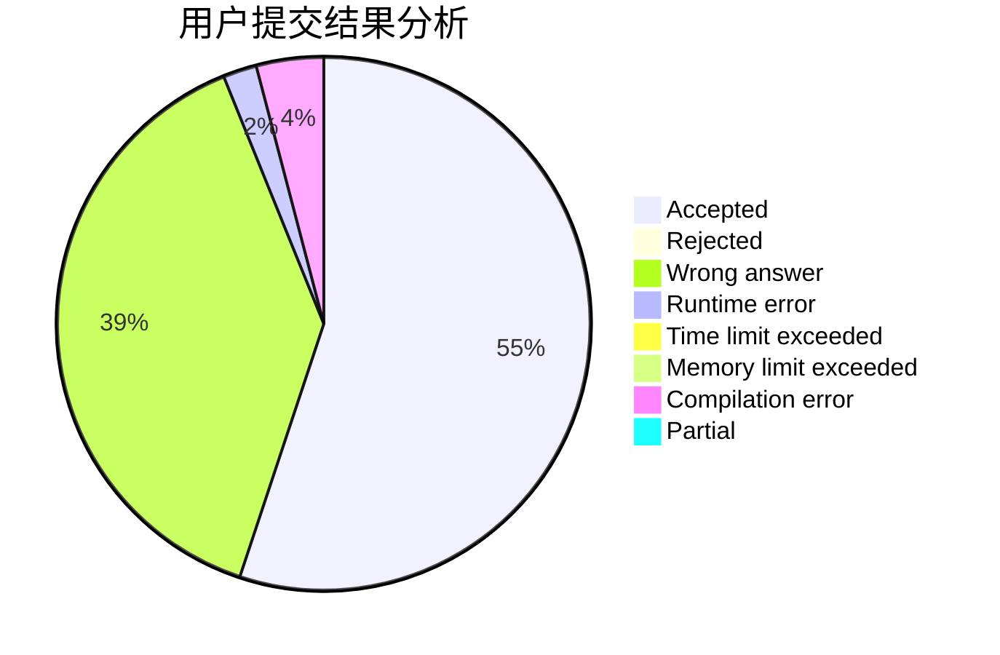
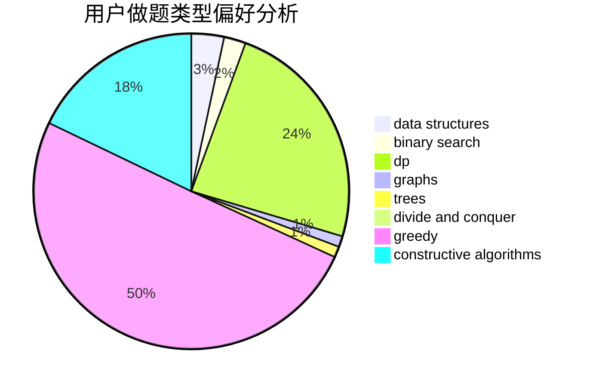
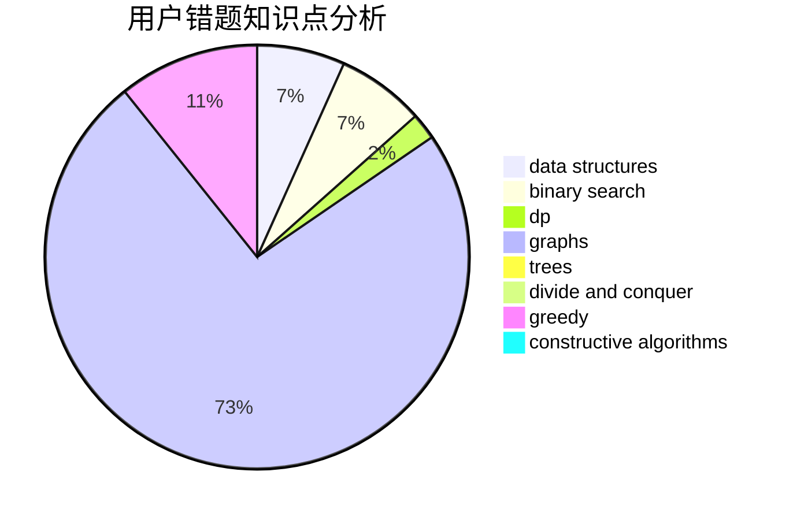

# y0y68

<!-- tabs:start -->

#### **用户提交结果分析**

#### **用户做题类型偏好分析**

#### **用户错题知识点分析**

<!-- tabs:end -->
# 推荐题目
[3C](https://codeforces.com/contest/3/problem/C)		brute force,
                        games,
                        implementation		  
[535C](https://codeforces.com/contest/535/problem/C)		binary search,
                        greedy,
                        math		  
[1148H](https://codeforces.com/contest/1148/problem/H)		data structures		  
[791E](https://codeforces.com/contest/791/problem/E)		dsu,graphs,sortings,trees		  
[653B](https://codeforces.com/contest/653/problem/B)		brute force,
                        dfs and similar,
                        dp,
                        strings		  
[459C](https://codeforces.com/contest/459/problem/C)		combinatorics,
                        constructive algorithms,
                        math		  
[809A](https://codeforces.com/contest/809/problem/A)		implementation,
                        math,
                        sortings		  
[1185G2](https://codeforces.com/contest/1185G/problem/2)		combinatorics,
                        dp		  
[641F](https://codeforces.com/contest/641/problem/F)		nan		  
[883D](https://codeforces.com/contest/883/problem/D)		binary search,
                        dp,
                        math		  
