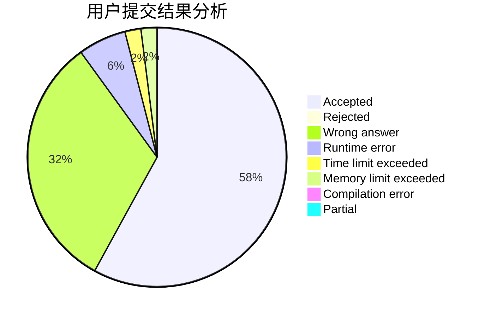
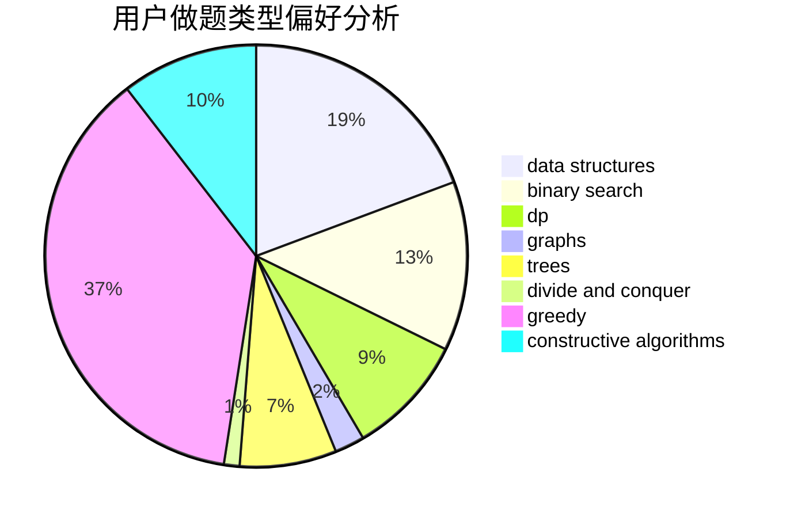
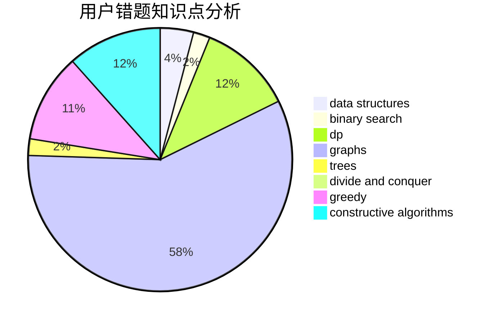

# y1s1

<!-- tabs:start -->

#### **用户提交结果分析**

#### **用户做题类型偏好分析**

#### **用户错题知识点分析**

<!-- tabs:end -->
# 推荐题目
[794E](https://codeforces.com/contest/794/problem/E)		games,
                        math		  
[516E](https://codeforces.com/contest/516/problem/E)		math,
                        number theory		  
[345A](https://codeforces.com/contest/345/problem/A)		*special problem,
                        probabilities		  
[1291E](https://codeforces.com/contest/1291/problem/E)		dsu,graphs,sortings,trees		  
[1358D](https://codeforces.com/contest/1358/problem/D)		binary search,
                        brute force,
                        greedy,
                        implementation,
                        two pointers		  
[226B](https://codeforces.com/contest/226/problem/B)		greedy		  
[256D](https://codeforces.com/contest/256/problem/D)		dp		  
[573D](https://codeforces.com/contest/573/problem/D)		data structures,
                        divide and conquer,
                        dp		  
[452A](https://codeforces.com/contest/452/problem/A)		brute force,
                        implementation,
                        strings		  
[349B](https://codeforces.com/contest/349/problem/B)		data structures,
                        dp,
                        greedy,
                        implementation		  
