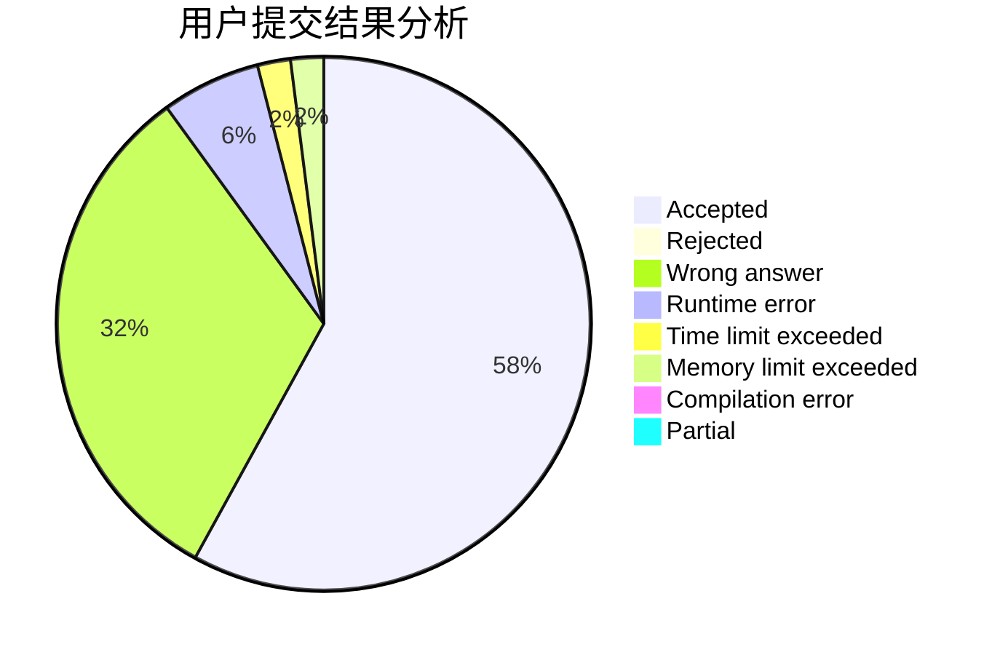
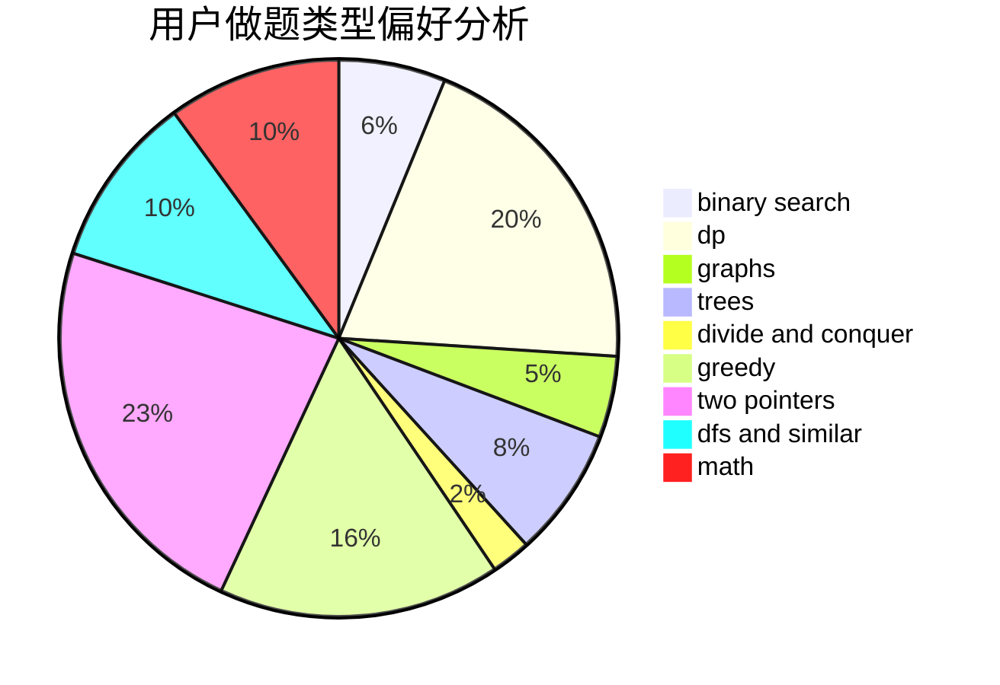

# y1s1

<!-- tabs:start -->

#### **用户提交结果分析**

#### **用户做题类型偏好分析**

<!-- tabs:end -->
# 推荐题目
[809E](https://codeforces.com/contest/809/problem/E)
[543E](https://codeforces.com/contest/543/problem/E)
[371C](https://codeforces.com/contest/371/problem/C)
[1298D](https://codeforces.com/contest/1298/problem/D)
[1366F](https://codeforces.com/contest/1366/problem/F)
[245A](https://codeforces.com/contest/245/problem/A)
[274C](https://codeforces.com/contest/274/problem/C)
[593B](https://codeforces.com/contest/593/problem/B)
[474A](https://codeforces.com/contest/474/problem/A)
[376A](https://codeforces.com/contest/376/problem/A)
