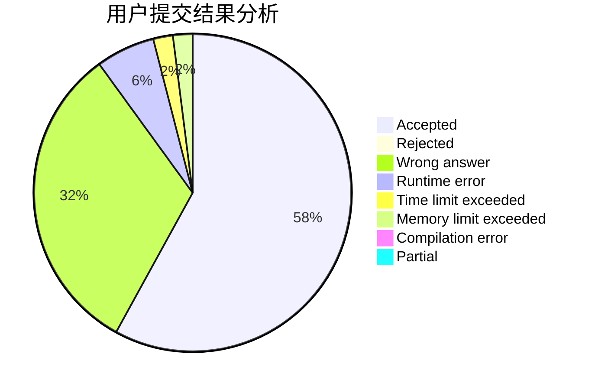
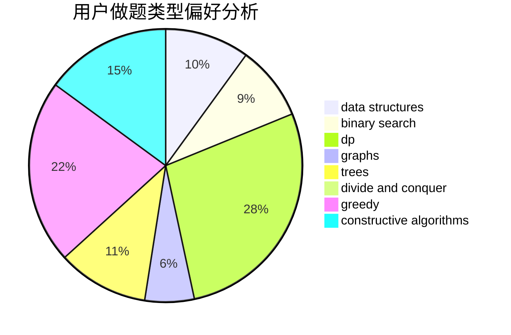
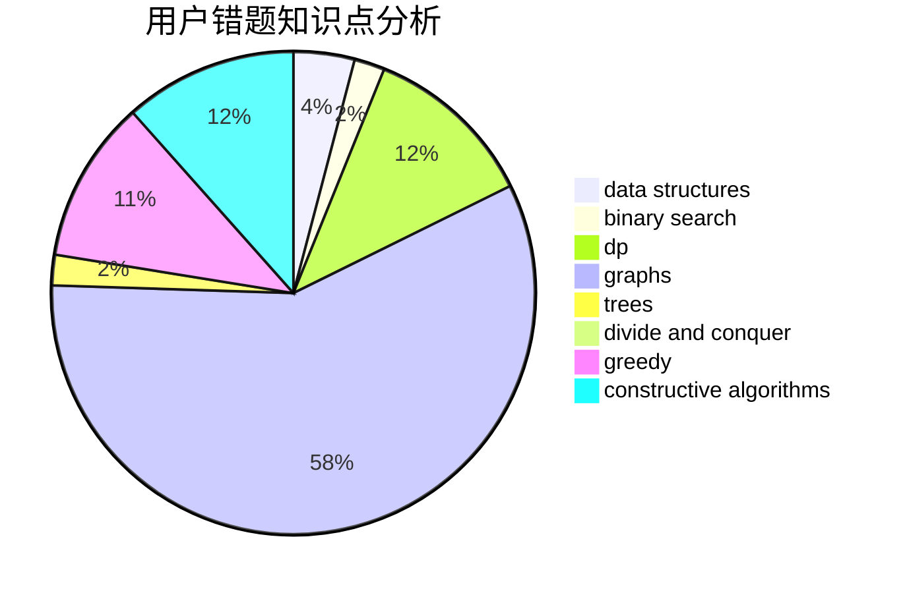

# y1s1

<!-- tabs:start -->

#### **用户提交结果分析**

#### **用户做题类型偏好分析**

#### **用户错题知识点分析**

<!-- tabs:end -->
# 推荐题目
[809E](https://codeforces.com/contest/809/problem/E)		divide and conquer,
                        math,
                        number theory,
                        trees		  
[543E](https://codeforces.com/contest/543/problem/E)		constructive algorithms,
                        data structures		  
[371C](https://codeforces.com/contest/371/problem/C)		binary search,
                        brute force		  
[1298D](https://codeforces.com/contest/1298/problem/D)		dsu,graphs,sortings,trees		  
[1366F](https://codeforces.com/contest/1366/problem/F)		binary search,
                        dp,
                        geometry,
                        graphs		  
[245A](https://codeforces.com/contest/245/problem/A)		implementation		  
[274C](https://codeforces.com/contest/274/problem/C)		brute force,
                        geometry		  
[593B](https://codeforces.com/contest/593/problem/B)		geometry,
                        sortings		  
[474A](https://codeforces.com/contest/474/problem/A)		implementation		  
[376A](https://codeforces.com/contest/376/problem/A)		implementation,
                        math		  
