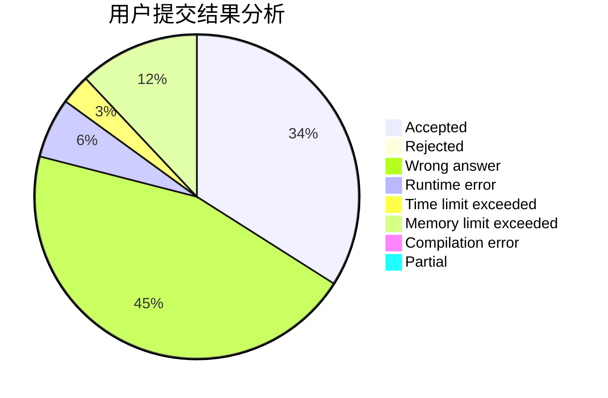
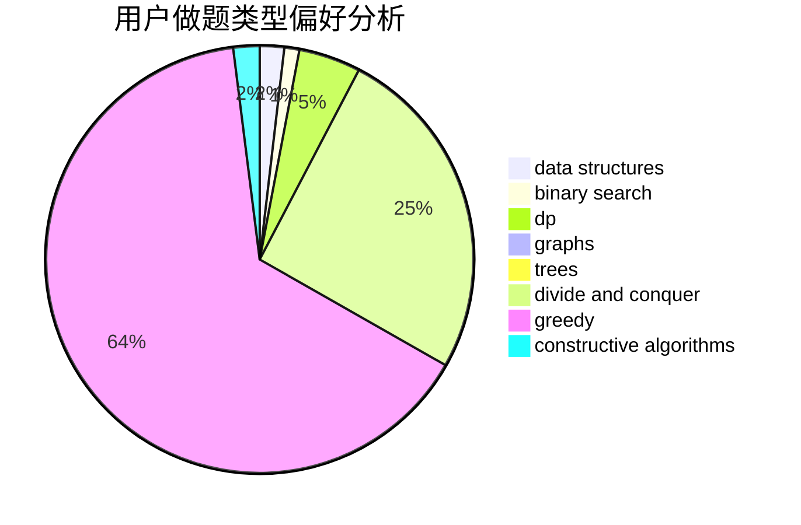
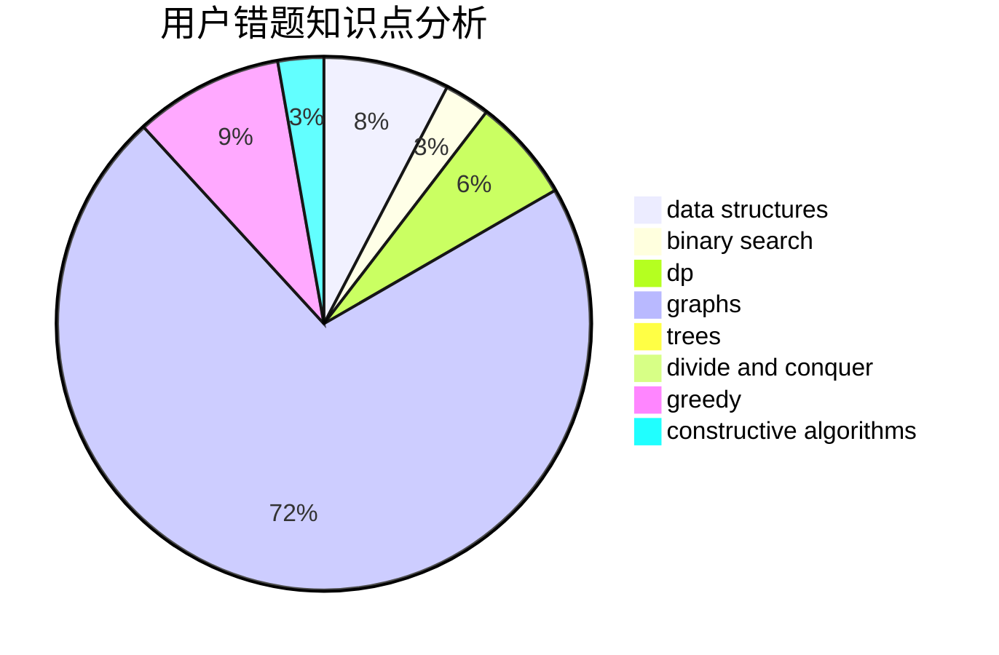

# y2823774827y

<!-- tabs:start -->

#### **用户提交结果分析**

#### **用户做题类型偏好分析**

#### **用户错题知识点分析**

<!-- tabs:end -->
# 推荐题目
[1003B](https://codeforces.com/contest/1003/problem/B)		constructive algorithms		  
[498D](https://codeforces.com/contest/498/problem/D)		data structures,
                        dp,
                        number theory		  
[946E](https://codeforces.com/contest/946/problem/E)		greedy,
                        implementation		  
[18E](https://codeforces.com/contest/18/problem/E)		dp		  
[446D](https://codeforces.com/contest/446/problem/D)		math,
                        matrices,
                        probabilities		  
[1505F](https://codeforces.com/contest/1505/problem/F)		math		  
[135B](https://codeforces.com/contest/135/problem/B)		brute force,
                        geometry,
                        math		  
[1012C](https://codeforces.com/contest/1012/problem/C)		dp		  
[543E](https://codeforces.com/contest/543/problem/E)		constructive algorithms,
                        data structures		  
[456B](https://codeforces.com/contest/456/problem/B)		math,
                        number theory		  
