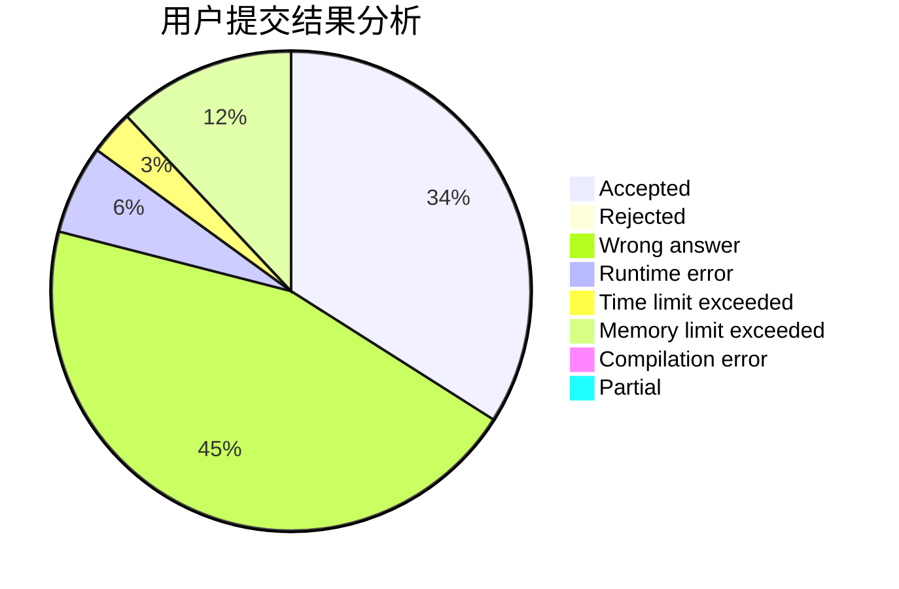
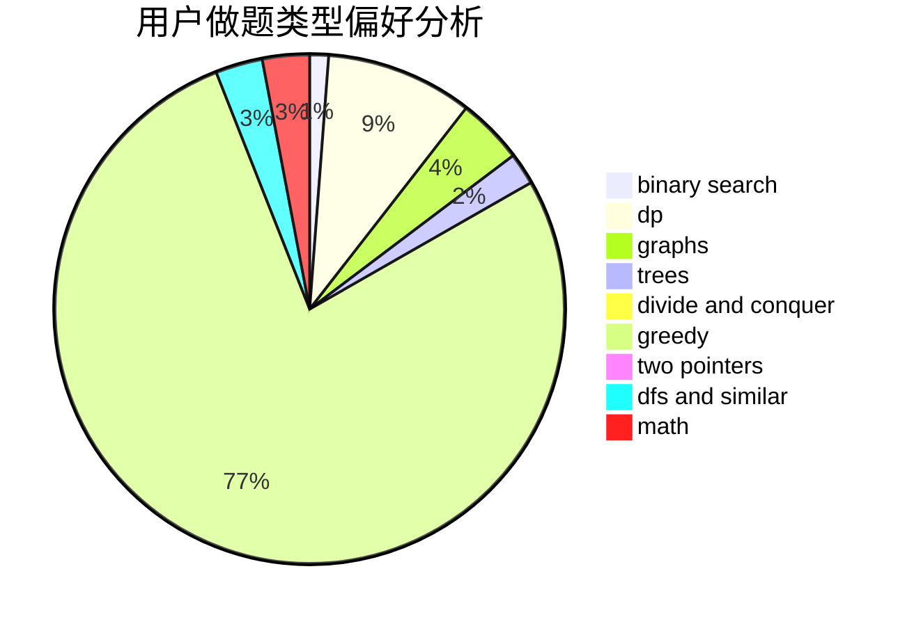

# y2823774827y

<!-- tabs:start -->

#### **用户提交结果分析**

#### **用户做题类型偏好分析**

<!-- tabs:end -->
# 推荐题目
[1003E](https://codeforces.com/contest/1003/problem/E)
[519D](https://codeforces.com/contest/519/problem/D)
[963B](https://codeforces.com/contest/963/problem/B)
[215C](https://codeforces.com/contest/215/problem/C)
[466E](https://codeforces.com/contest/466/problem/E)
[155A](https://codeforces.com/contest/155/problem/A)
[13681](https://codeforces.com/contest/1368/problem/1)
[1013A](https://codeforces.com/contest/1013/problem/A)
[568A](https://codeforces.com/contest/568/problem/A)
[477B](https://codeforces.com/contest/477/problem/B)
