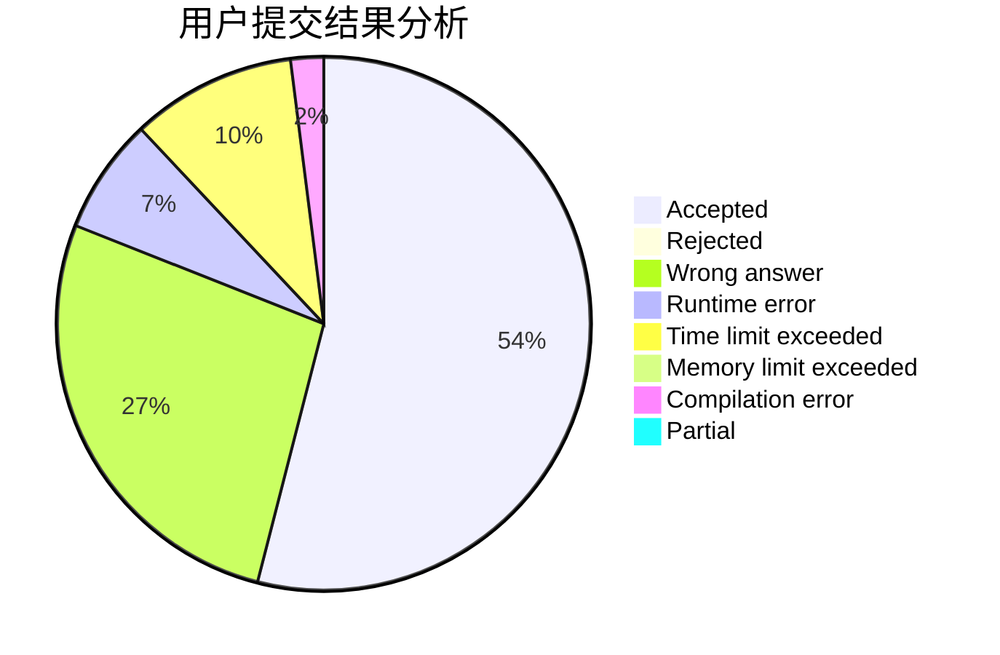
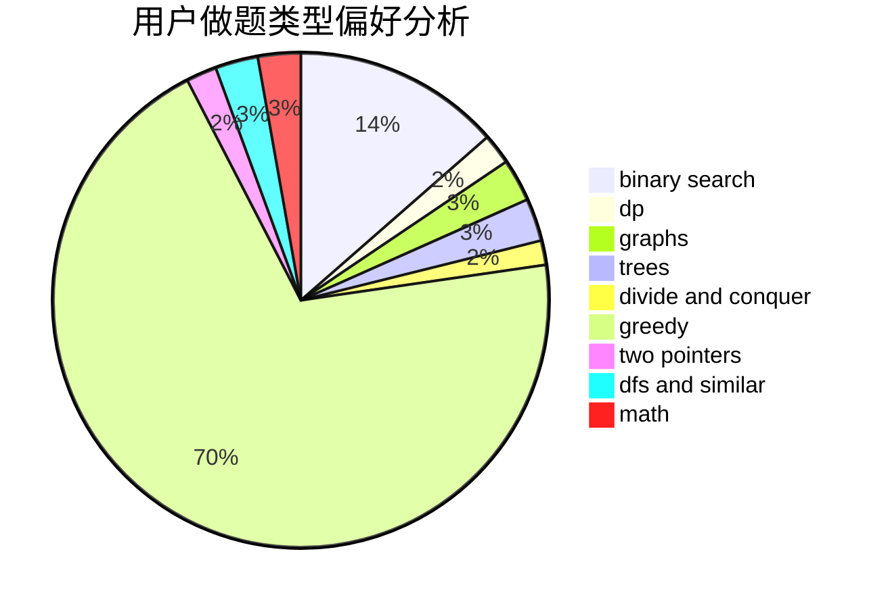

# yajun

<!-- tabs:start -->

#### **用户提交结果分析**

#### **用户做题类型偏好分析**

<!-- tabs:end -->
# 推荐题目
[985E](https://codeforces.com/contest/985/problem/E)
[1248C](https://codeforces.com/contest/1248/problem/C)
[816D](https://codeforces.com/contest/816/problem/D)
[633B](https://codeforces.com/contest/633/problem/B)
[712E](https://codeforces.com/contest/712/problem/E)
[1371F](https://codeforces.com/contest/1371/problem/F)
[303D](https://codeforces.com/contest/303/problem/D)
[1145F](https://codeforces.com/contest/1145/problem/F)
[1159A](https://codeforces.com/contest/1159/problem/A)
[1490C](https://codeforces.com/contest/1490/problem/C)
