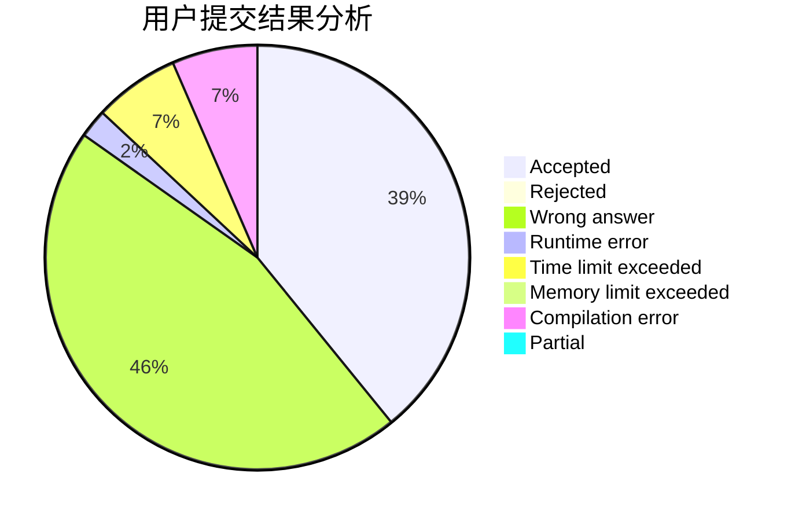
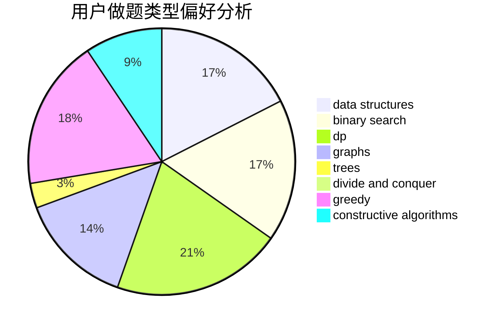
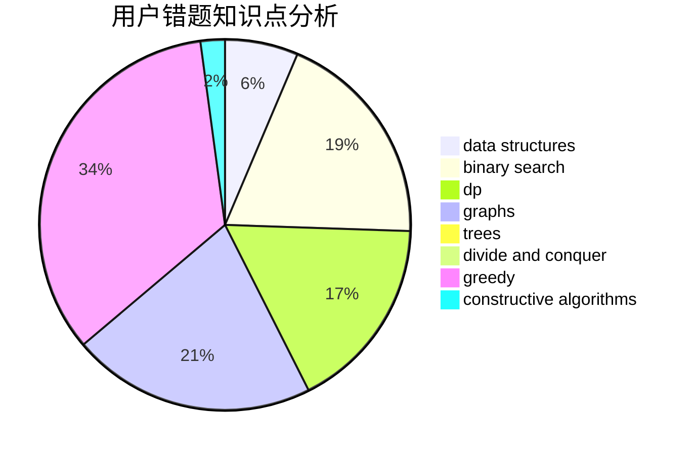

# 1739206233

<!-- tabs:start -->

#### **用户提交结果分析**

#### **用户做题类型偏好分析**

#### **用户错题知识点分析**

<!-- tabs:end -->
# 推荐题目
[1178C](https://codeforces.com/contest/1178/problem/C)		combinatorics,
                        greedy,
                        math		  
[1178B](https://codeforces.com/contest/1178/problem/B)		dp,
                        strings		  
[1173A](https://codeforces.com/contest/1173/problem/A)		greedy		  
[1176C](https://codeforces.com/contest/1176/problem/C)		dp,
                        greedy,
                        implementation		  
[1175D](https://codeforces.com/contest/1175/problem/D)		greedy,
                        sortings		  
[11722](https://codeforces.com/contest/1172/problem/2)		dsu,graphs,sortings,trees		  
[1172A](https://codeforces.com/contest/1172/problem/A)		greedy,
                        implementation		  
[11732](https://codeforces.com/contest/1173/problem/2)		dsu,graphs,sortings,trees		  
[1176E](https://codeforces.com/contest/1176/problem/E)		dfs and similar,
                        dsu,
                        graphs,
                        shortest paths,
                        trees		  
[1175E](https://codeforces.com/contest/1175/problem/E)		data structures,
                        dfs and similar,
                        divide and conquer,
                        dp,
                        greedy,
                        implementation,
                        trees		  
