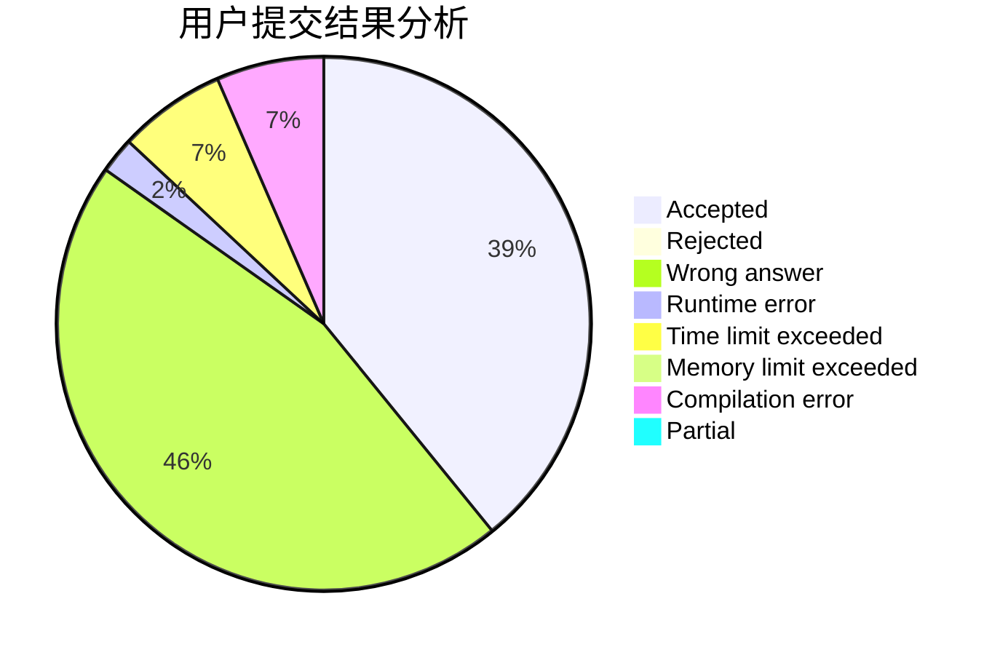
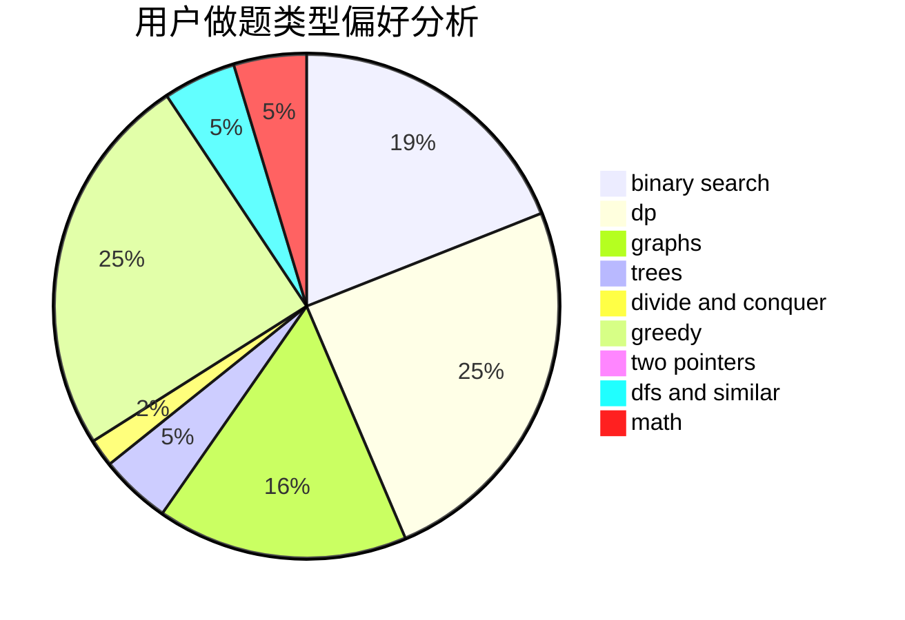

# 1739206233

<!-- tabs:start -->

#### **用户提交结果分析**

#### **用户做题类型偏好分析**

<!-- tabs:end -->
# 推荐题目
[1178C](https://codeforces.com/contest/1178/problem/C)
[1178B](https://codeforces.com/contest/1178/problem/B)
[1173A](https://codeforces.com/contest/1173/problem/A)
[1176C](https://codeforces.com/contest/1176/problem/C)
[1175D](https://codeforces.com/contest/1175/problem/D)
[11722](https://codeforces.com/contest/1172/problem/2)
[1172A](https://codeforces.com/contest/1172/problem/A)
[11732](https://codeforces.com/contest/1173/problem/2)
[1176E](https://codeforces.com/contest/1176/problem/E)
[1175E](https://codeforces.com/contest/1175/problem/E)
